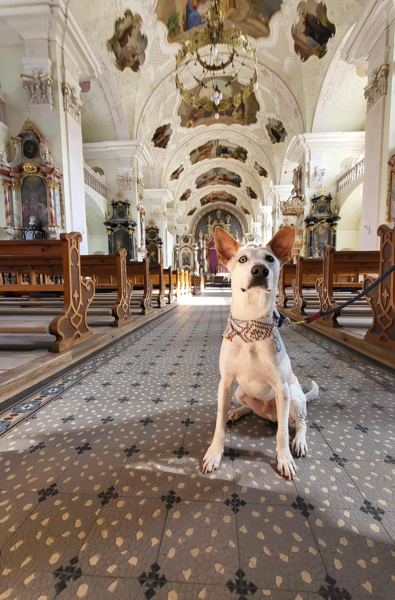

I am so happy to be invited by [浪浪別哭 (Lang Lang Don't Cry)](https://open.spotify.com/episode/3MQKTr0qlZTo7LiQmlWGbu) to share our story of adopting Genie from Taiwan to Switzerland!

Without the help of the foster family, volunteers, dog ambassadors, and 浪浪別哭, it would have been very hard for Genie to make it all the way to Switzerland. I am deeply grateful to so many people who helped make this journey possible. 🐾

<iframe style="border-radius:12px" src="https://open.spotify.com/embed/episode/3MQKTr0qlZTo7LiQmlWGbu" width="100%" height="152" frameBorder="0" allowfullscreen="" allow="autoplay; clipboard-write; encrypted-media; fullscreen; picture-in-picture" loading="lazy"></iframe>

> 其實沒有愛媽、中途家庭、志工、護犬大使還有浪浪別哭的幫忙，Genie也很難來到瑞士，再次謝謝好多人的幫忙跟 浪浪別哭 的邀請💖。很開心能分享最近養狗狗的經驗！

*[Ep36. 浪浪別哭 x 崎崎] 浪浪別哭 lang lang don't cry — a foster cafe in Taiwan*
