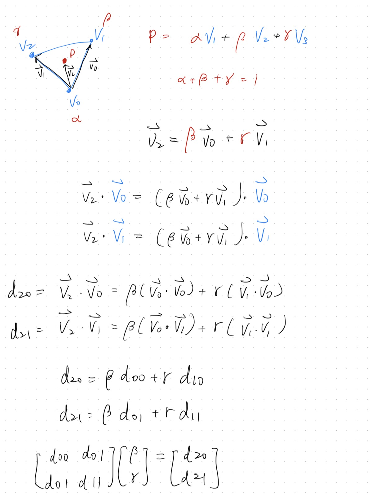
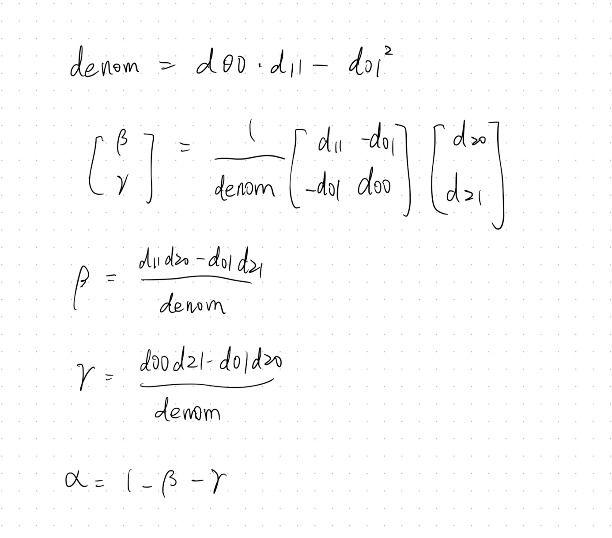

**Given:** a triangle with vertices $V_0$, $V_1$, $V_2$ and a point $P$ inside it.

**Find:** three weights $(\alpha, \beta, \gamma)$ — the barycentric coordinates of $P$ — such that:

$$P = \alpha V_0 + \beta V_1 + \gamma V_2, \quad \alpha + \beta + \gamma = 1$$

When $\alpha = 1$, $P$ is exactly at $V_0$. When all three are equal ($\frac{1}{3}$), $P$ is at the centroid. They interpolate smoothly in between — which makes them useful for texture mapping, point-in-triangle tests, and meshing algorithms.

## Area-based intuition

The most natural way to think about barycentric coordinates is through areas. Each coordinate equals the ratio of the sub-triangle area opposite that vertex to the total triangle area:

$$\alpha = \frac{\text{area}(P, V_1, V_2)}{\text{area}(V_0, V_1, V_2)}, \quad \beta = \frac{\text{area}(V_0, P, V_2)}{\text{area}(V_0, V_1, V_2)}, \quad \gamma = \frac{\text{area}(V_0, V_1, P)}{\text{area}(V_0, V_1, V_2)}$$

Geometrically this is clear — as $P$ moves toward $V_0$, its opposite sub-triangle grows to fill the whole triangle, so $\alpha \to 1$. The three sub-triangles always partition the whole, so $\alpha + \beta + \gamma = 1$ holds automatically.

Triangle area is computed via the cross product. For vertices $A$, $B$, $C$:

$$\text{area}(A, B, C) = \frac{1}{2} \| (B - A) \times (C - A) \|$$

So each coordinate requires a cross product and a vector norm (square root). For a single query this is fine, but if you're testing thousands of points against the same triangle, the cost adds up.

## Dot product derivation

A more efficient approach avoids cross products entirely. Again, the knowns are $V_0$, $V_1$, $V_2$, $P$ — and the unknowns are $\beta$ and $\gamma$ (we get $\alpha = 1 - \beta - \gamma$ for free from the constraint).

Define two edge vectors from $V_0$ and a vector from $V_0$ to $P$:

$$\vec{v}_0 = V_1 - V_0, \quad \vec{v}_1 = V_2 - V_0, \quad \vec{v}_2 = P - V_0$$

Express $\vec{v}_2$ as a linear combination of $\vec{v}_0$ and $\vec{v}_1$:

$$\vec{v}_2 = \beta \cdot \vec{v}_0 + \gamma \cdot \vec{v}_1$$

Take dot products of both sides with $\vec{v}_0$ and $\vec{v}_1$:

$$\vec{v}_2 \cdot \vec{v}_0 = \beta(\vec{v}_0 \cdot \vec{v}_0) + \gamma(\vec{v}_1 \cdot \vec{v}_0)$$
$$\vec{v}_2 \cdot \vec{v}_1 = \beta(\vec{v}_0 \cdot \vec{v}_1) + \gamma(\vec{v}_1 \cdot \vec{v}_1)$$

Let $d_{ij} = \vec{v}_i \cdot \vec{v}_j$. The left-hand side entries are all dot products of known vectors; the right-hand side entries involve $P$. This gives a 2×2 linear system with $\beta$ and $\gamma$ as unknowns:

$$\begin{bmatrix} d_{00} & d_{01} \\\\ d_{01} & d_{11} \end{bmatrix} \begin{bmatrix} \beta \\\\ \gamma \end{bmatrix} = \begin{bmatrix} d_{20} \\\\ d_{21} \end{bmatrix}$$



Solving by matrix inverse (determinant = $d_{00} \cdot d_{11} - d_{01}^2$):

$$\beta = \frac{d_{11} \cdot d_{20} - d_{01} \cdot d_{21}}{\text{denom}}, \quad \gamma = \frac{d_{00} \cdot d_{21} - d_{01} \cdot d_{20}}{\text{denom}}, \quad \alpha = 1 - \beta - \gamma$$



## Implementation

The dot products $d_{00}$, $d_{01}$, $d_{11}$ depend only on the triangle, so they can be precomputed once and reused for multiple point queries.

```cpp
#include <Eigen/Dense>

using Vec3 = Eigen::Vector3d;

struct BarycentricSolver {
    Vec3 v0, v1, orig;
    double d00, d01, d11, denom;

    BarycentricSolver(const Vec3& A, const Vec3& B, const Vec3& C)
        : orig(A), v0(B - A), v1(C - A)
    {
        d00   = v0.dot(v0);
        d01   = v0.dot(v1);
        d11   = v1.dot(v1);
        denom = d00 * d11 - d01 * d01;
    }

    // Returns (alpha, beta, gamma). Point is inside if all >= 0.
    Eigen::Vector3d compute(const Vec3& P) const {
        Vec3 v2 = P - orig;
        double d20 = v2.dot(v0);
        double d21 = v2.dot(v1);
        double beta  = (d11 * d20 - d01 * d21) / denom;
        double gamma = (d00 * d21 - d01 * d20) / denom;
        double alpha = 1.0 - beta - gamma;
        return {alpha, beta, gamma};
    }
};
```

A point $P$ is inside the triangle when $\alpha \geq 0$, $\beta \geq 0$, and $\gamma \geq 0$.
