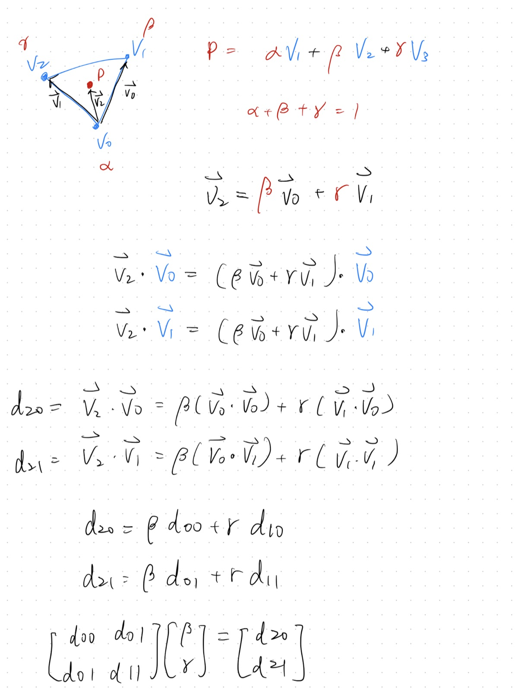
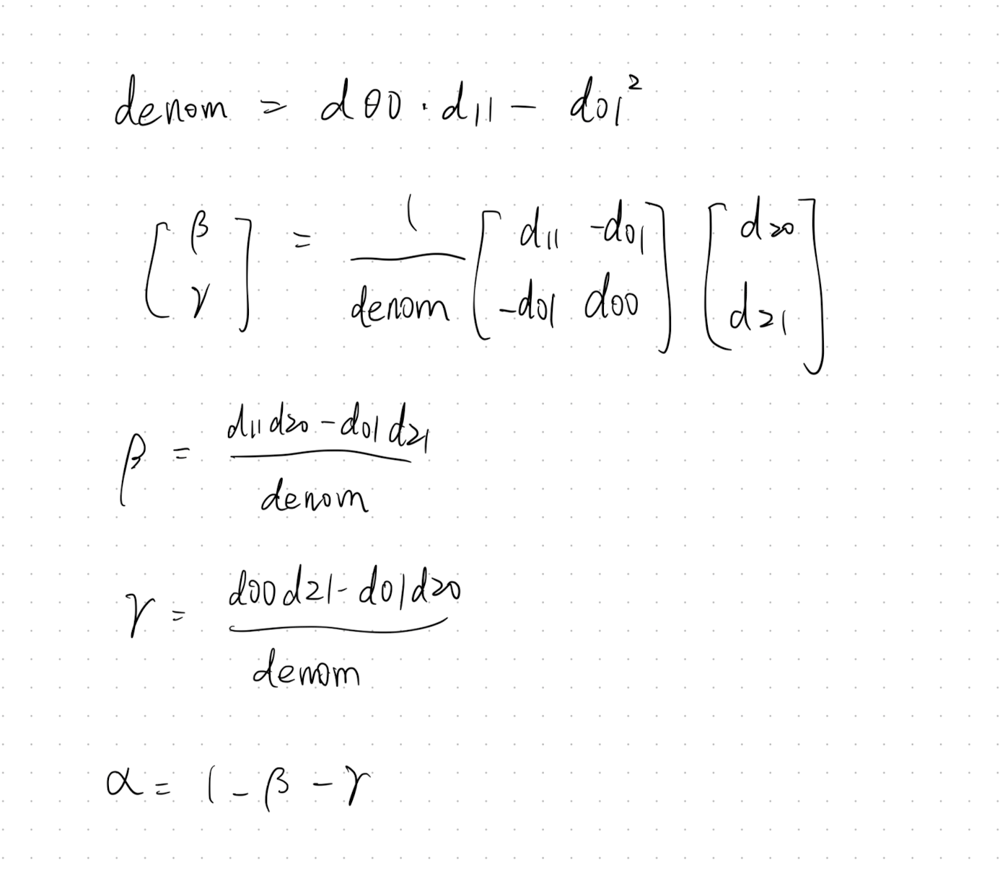

**Given:** a triangle with vertices $V_0$, $V_1$, $V_2$ and a point $P$ inside it.

**Find:** three weights $(\alpha, \beta, \gamma)$ — the barycentric coordinates of $P$ — such that:

$$P = \alpha V_0 + \beta V_1 + \gamma V_2, \quad \alpha + \beta + \gamma = 1$$

When $\alpha = 1$, $P$ is exactly at $V_0$. When all three are equal ($\frac{1}{3}$), $P$ is at the centroid. They interpolate smoothly in between — which makes them useful for texture mapping, point-in-triangle tests, and meshing algorithms.

Drag $P$ or any vertex to see the coordinates update in real time.

<div style="margin:2rem 0;">
<canvas id="bary-canvas" width="760" height="460" style="width:100%;display:block;border-radius:6px;border:1px solid var(--border);cursor:crosshair;touch-action:none;"></canvas>
<div id="bary-coords" style="display:flex;gap:2rem;margin-top:1rem;font-family:monospace;font-size:0.9rem;flex-wrap:wrap;"></div>
</div>

<script>
(function () {
  const canvas = document.getElementById('bary-canvas');
  const ctx = canvas.getContext('2d');
  const coordsEl = document.getElementById('bary-coords');
  const W = canvas.width, H = canvas.height;

  let verts = [
    { x: 220, y: 80  },
    { x: 100, y: 400 },
    { x: 660, y: 370 },
  ];
  let P = { x: 280, y: 240 };

  const COLORS = ['#f43f5e', '#6366f1', '#14b8a6'];
  const RADIUS = 7;
  let dragging = null;

  function dot(a, b) { return a.x * b.x + a.y * b.y; }
  function sub(a, b) { return { x: a.x - b.x, y: a.y - b.y }; }

  function computeBary(p, v0, v1, v2) {
    const e0 = sub(v1, v0), e1 = sub(v2, v0), e2 = sub(p, v0);
    const d00 = dot(e0, e0), d01 = dot(e0, e1), d11 = dot(e1, e1);
    const d20 = dot(e2, e0), d21 = dot(e2, e1);
    const denom = d00 * d11 - d01 * d01;
    const beta  = (d11 * d20 - d01 * d21) / denom;
    const gamma = (d00 * d21 - d01 * d20) / denom;
    return { alpha: 1 - beta - gamma, beta, gamma };
  }

  function isDark() {
    return document.documentElement.dataset.theme === 'dark';
  }

  function draw() {
    const dark = isDark();
    const bg          = dark ? '#2a2d3a' : '#f1f5f9';
    const fg          = dark ? '#f1f5f9' : '#0f172a';
    const fgMuted     = dark ? '#94a3b8' : '#64748b';
    const triEdge     = dark ? '#64748b' : '#cbd5e1';
    const subTriAlpha = 0.12;

    ctx.clearRect(0, 0, W, H);
    ctx.fillStyle = bg;
    ctx.fillRect(0, 0, W, H);

    const [v0, v1, v2] = verts;
    const { alpha, beta, gamma } = computeBary(P, v0, v1, v2);
    const inside = alpha >= 0 && beta >= 0 && gamma >= 0;

    // Sub-triangle fills
    [[P, v1, v2, COLORS[0], Math.max(0, alpha)],
     [P, v0, v2, COLORS[1], Math.max(0, beta)],
     [P, v0, v1, COLORS[2], Math.max(0, gamma)]].forEach(([a, b, c, col, w]) => {
      ctx.beginPath();
      ctx.moveTo(a.x, a.y); ctx.lineTo(b.x, b.y); ctx.lineTo(c.x, c.y);
      ctx.closePath();
      ctx.fillStyle = col;
      ctx.globalAlpha = subTriAlpha + w * 0.25;
      ctx.fill();
      ctx.globalAlpha = 1;
    });

    // Triangle edge
    ctx.beginPath();
    ctx.moveTo(v0.x, v0.y); ctx.lineTo(v1.x, v1.y);
    ctx.lineTo(v2.x, v2.y); ctx.closePath();
    ctx.strokeStyle = triEdge;
    ctx.lineWidth = 1.5;
    ctx.stroke();

    // Dashed lines P to vertices
    if (inside) {
      [v0, v1, v2].forEach((v, i) => {
        ctx.beginPath();
        ctx.moveTo(P.x, P.y); ctx.lineTo(v.x, v.y);
        ctx.strokeStyle = COLORS[i];
        ctx.globalAlpha = 0.5;
        ctx.lineWidth = 1;
        ctx.setLineDash([3, 5]);
        ctx.stroke();
        ctx.setLineDash([]);
        ctx.globalAlpha = 1;
      });
    }

    // Vertex dots
    const labels = ['V₀', 'V₁', 'V₂'];
    const offsets = [{ x: 0, y: -16 }, { x: -20, y: 18 }, { x: 22, y: 18 }];
    verts.forEach((v, i) => {
      ctx.beginPath();
      ctx.arc(v.x, v.y, RADIUS, 0, Math.PI * 2);
      ctx.fillStyle = COLORS[i];
      ctx.fill();
      ctx.fillStyle = fg;
      ctx.font = '600 13px ui-monospace, monospace';
      ctx.textAlign = 'center';
      ctx.fillText(labels[i], v.x + offsets[i].x, v.y + offsets[i].y);
    });

    // P dot
    ctx.beginPath();
    ctx.arc(P.x, P.y, RADIUS, 0, Math.PI * 2);
    ctx.fillStyle = inside ? (dark ? '#e2e8f0' : '#334155') : '#e05555';
    ctx.fill();
    ctx.fillStyle = inside ? (dark ? '#334155' : '#ffffff') : '#ffffff';
    ctx.font = '600 11px ui-monospace, monospace';
    ctx.textAlign = 'center';
    ctx.fillText('P', P.x, P.y + 4);

    // Coords
    const fmt = n => n.toFixed(3);
    const names = ['α', 'β', 'γ'];
    const vals  = [alpha, beta, gamma];
    coordsEl.innerHTML = names.map((n, i) =>
      `<span style="color:${COLORS[i]};font-weight:600">${n}</span>` +
      `<span> = ${fmt(vals[i])}</span>`
    ).join('') +
    `<span style="margin-left:auto;opacity:0.5">α+β+γ = ${fmt(alpha+beta+gamma)}</span>` +
    (!inside ? `<span style="color:#e05555;margin-left:1rem">outside triangle</span>` : '');
  }

  function getPos(e) {
    const r = canvas.getBoundingClientRect();
    const cx = e.touches ? e.touches[0].clientX : e.clientX;
    const cy = e.touches ? e.touches[0].clientY : e.clientY;
    return { x: (cx - r.left) * W / r.width, y: (cy - r.top) * H / r.height };
  }

  function dist(a, b) { return Math.hypot(a.x - b.x, a.y - b.y); }

  function onDown(e) {
    e.preventDefault();
    const pos = getPos(e);
    if (dist(pos, P) <= RADIUS + 6) { dragging = 'P'; return; }
    for (let i = 0; i < 3; i++)
      if (dist(pos, verts[i]) <= RADIUS + 6) { dragging = i; return; }
  }

  function onMove(e) {
    if (dragging === null) return;
    e.preventDefault();
    const pos = getPos(e);
    if (dragging === 'P') { P.x = pos.x; P.y = pos.y; }
    else { verts[dragging].x = pos.x; verts[dragging].y = pos.y; }
    draw();
  }

  function onUp() { dragging = null; }

  canvas.addEventListener('mousedown', onDown);
  canvas.addEventListener('mousemove', onMove);
  canvas.addEventListener('mouseup', onUp);
  canvas.addEventListener('touchstart', onDown, { passive: false });
  canvas.addEventListener('touchmove', onMove, { passive: false });
  canvas.addEventListener('touchend', onUp);

  new MutationObserver(draw).observe(document.documentElement, { attributes: true, attributeFilter: ['data-theme'] });

  draw();
})();
</script>

## Area-based intuition

The most natural way to think about barycentric coordinates is through areas. Each coordinate equals the ratio of the sub-triangle area opposite that vertex to the total triangle area:

$$\alpha = \frac{\text{area}(P, V_1, V_2)}{\text{area}(V_0, V_1, V_2)}, \quad \beta = \frac{\text{area}(V_0, P, V_2)}{\text{area}(V_0, V_1, V_2)}, \quad \gamma = \frac{\text{area}(V_0, V_1, P)}{\text{area}(V_0, V_1, V_2)}$$

Geometrically this is clear — as $P$ moves toward $V_0$, its opposite sub-triangle grows to fill the whole triangle, so $\alpha \to 1$. The three sub-triangles always partition the whole, so $\alpha + \beta + \gamma = 1$ holds automatically.

Triangle area is computed via the cross product. For vertices $A$, $B$, $C$:

$$\text{area}(A, B, C) = \frac{1}{2} \| (B - A) \times (C - A) \|$$

So each coordinate requires a cross product and a vector norm (square root). For a single query this is fine, but if you're testing thousands of points against the same triangle, the cost adds up.

## Dot product derivation

A more efficient approach avoids cross products entirely. Again, the knowns are $V_0$, $V_1$, $V_2$, $P$ — and the unknowns are $\beta$ and $\gamma$ (we get $\alpha = 1 - \beta - \gamma$ for free from the constraint).

Define two edge vectors from $V_0$ and a vector from $V_0$ to $P$:

$$\vec{v}_0 = V_1 - V_0, \quad \vec{v}_1 = V_2 - V_0, \quad \vec{v}_2 = P - V_0$$

Express $\vec{v}_2$ as a linear combination of $\vec{v}_0$ and $\vec{v}_1$:

$$\vec{v}_2 = \beta \cdot \vec{v}_0 + \gamma \cdot \vec{v}_1$$

Take dot products of both sides with $\vec{v}_0$ and $\vec{v}_1$:

$$\vec{v}_2 \cdot \vec{v}_0 = \beta(\vec{v}_0 \cdot \vec{v}_0) + \gamma(\vec{v}_1 \cdot \vec{v}_0)$$
$$\vec{v}_2 \cdot \vec{v}_1 = \beta(\vec{v}_0 \cdot \vec{v}_1) + \gamma(\vec{v}_1 \cdot \vec{v}_1)$$

Let $d_{ij} = \vec{v}_i \cdot \vec{v}_j$. The left-hand side entries are all dot products of known vectors; the right-hand side entries involve $P$. This gives a 2×2 linear system with $\beta$ and $\gamma$ as unknowns:

$$\begin{bmatrix} d_{00} & d_{01} \\\\ d_{01} & d_{11} \end{bmatrix} \begin{bmatrix} \beta \\\\ \gamma \end{bmatrix} = \begin{bmatrix} d_{20} \\\\ d_{21} \end{bmatrix}$$



Solving by matrix inverse (determinant = $d_{00} \cdot d_{11} - d_{01}^2$):

$$\beta = \frac{d_{11} \cdot d_{20} - d_{01} \cdot d_{21}}{\text{denom}}, \quad \gamma = \frac{d_{00} \cdot d_{21} - d_{01} \cdot d_{20}}{\text{denom}}, \quad \alpha = 1 - \beta - \gamma$$



## Implementation

The dot products $d_{00}$, $d_{01}$, $d_{11}$ depend only on the triangle, so they can be precomputed once and reused for multiple point queries.

```cpp
#include <Eigen/Dense>

using Vec3 = Eigen::Vector3d;

struct BarycentricSolver {
    Vec3 v0, v1, orig;
    double d00, d01, d11, denom;

    BarycentricSolver(const Vec3& A, const Vec3& B, const Vec3& C)
        : orig(A), v0(B - A), v1(C - A)
    {
        d00   = v0.dot(v0);
        d01   = v0.dot(v1);
        d11   = v1.dot(v1);
        denom = d00 * d11 - d01 * d01;
    }

    // Returns (alpha, beta, gamma). Point is inside if all >= 0.
    Eigen::Vector3d compute(const Vec3& P) const {
        Vec3 v2 = P - orig;
        double d20 = v2.dot(v0);
        double d21 = v2.dot(v1);
        double beta  = (d11 * d20 - d01 * d21) / denom;
        double gamma = (d00 * d21 - d01 * d20) / denom;
        double alpha = 1.0 - beta - gamma;
        return {alpha, beta, gamma};
    }
};
```

A point $P$ is inside the triangle when $\alpha \geq 0$, $\beta \geq 0$, and $\gamma \geq 0$.
