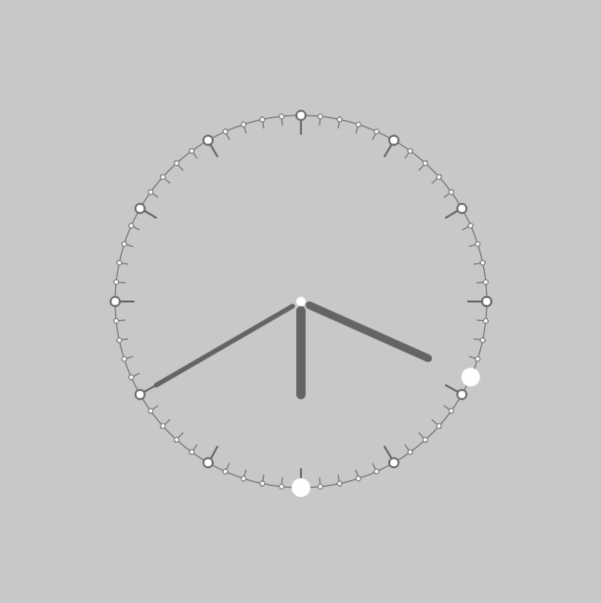
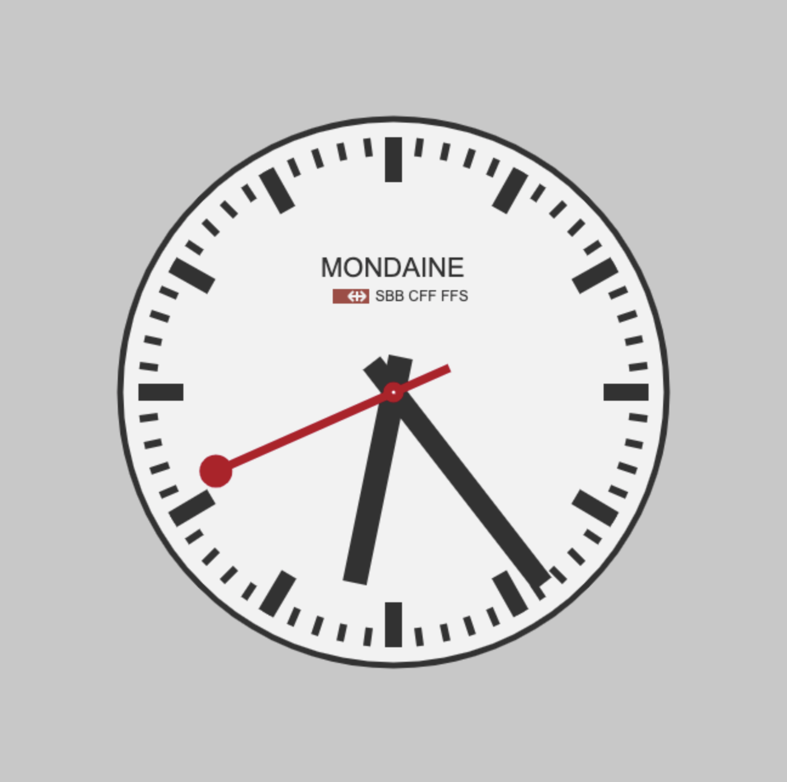

Clock Design using Processing

* [ClockDesign\_001\_Basic](#clockdesign_001_basic)
* [ClockDesign\_002\_Mondaine](#clockdesign_002_mondaine)

---

## ClockDesign_001_Basic

Clock Design through code. Minimalism 時間設計 — 極簡風



```java
float h, m, s;

void setup() {
  size(650, 650);
  smooth();
}

void draw() {
  background(200);

  pushMatrix();
  translate(width/2, height/2);

  strokeWeight(1);
  stroke(100);
  noFill();
  ellipse(0, 0, 400, 400);

  s = 6*second()*(TWO_PI)/360 - PI/2;
  m = 6*minute()*(TWO_PI)/360 - PI/2;
  h = 30*hour()*(TWO_PI)/360 - PI/2;

  fill(255);
  for (int i = 0; i <= 60; i++) {
    strokeWeight(1);
    line(cos(i*6*(TWO_PI)/360)*203, sin(i*6*(TWO_PI)/360)*203, cos(i*6*(TWO_PI)/360)*190, sin(i*6*(TWO_PI)/360)*190);
    ellipse(cos(i*6*(TWO_PI)/360)*200, sin(i*6*(TWO_PI)/360)*200, 5, 5);

    if (i % 5 == 0) {
      strokeWeight(2);
      line(cos(i*6*(TWO_PI)/360)*203, sin(i*6*(TWO_PI)/360)*203, cos(i*6*(TWO_PI)/360)*180, sin(i*6*(TWO_PI)/360)*180);
      ellipse(cos(i/5*30*(TWO_PI)/360)*200, sin(i/5*30*(TWO_PI)/360)*200, 10, 10);
    }
  }

  noStroke();
  fill(255);
  ellipse(0, 0, 10, 10);

  //ellipse(cos(s)*200, sin(s)*200, 10, 10);
  //text(s + ", "+ second(), cos(s)*200, sin(s)*200);
  ellipse(cos(m)*200, sin(m)*200, 20, 20);
  //text(m + ", "+ minute(), cos(m)*200, sin(m)*200);
  ellipse(cos(h)*200, sin(h)*200, 20, 20);

  strokeWeight(5);
  stroke(100);
  line(cos(s)*180, sin(s)*180, cos(s)*10, sin(s)*10);
  strokeWeight(8);
  line(cos(m)*150, sin(m)*150, cos(m)*10, sin(m)*10);
  strokeWeight(10);
  line(cos(h)*100, sin(h)*100, cos(h)*10, sin(h)*10);

  popMatrix();
}
```

---

## ClockDesign_002_Mondaine

Clock Design through code. [Mondaine](http://www.mondaine.com/mondaine-watches/display/83) 時間設計 — 瑞士國鐵表



```java
float h, m, s;

void setup() {
  size(650, 650);
  smooth();
  strokeCap(SQUARE);
}

void draw() {
  background(200);

  pushMatrix();
  translate(width/2, height/2);

  strokeWeight(5);
  stroke(50);
  //noFill();
  fill(242);
  ellipse(0, 0, 450, 450);

  s = 6*second()*(TWO_PI)/360 - PI/2;
  m = 6*(minute())*(TWO_PI)/360 - PI/2;
  h = 30*hour()*(TWO_PI)/360 - PI/2;

  fill(255);
  for (int i = 0; i <= 60; i++) {
    strokeWeight(6);
    line(cos(i*6*(TWO_PI)/360)*210, sin(i*6*(TWO_PI)/360)*210, cos(i*6*(TWO_PI)/360)*195, sin(i*6*(TWO_PI)/360)*195);
    //ellipse(cos(i*6*(TWO_PI)/360)*200, sin(i*6*(TWO_PI)/360)*200, 5, 5);

    if (i % 5 == 0) {
      strokeWeight(14);
      line(cos(i*6*(TWO_PI)/360)*210, sin(i*6*(TWO_PI)/360)*210, cos(i*6*(TWO_PI)/360)*173, sin(i*6*(TWO_PI)/360)*173);
      //ellipse(cos(i/5*30*(TWO_PI)/360)*200, sin(i/5*30*(TWO_PI)/360)*200, 10, 10);
    }
  }
  fill(50);

  ////// logo
  textSize(22);
  text("MONDAINE", -60, -95);
  textSize(12);
  text("SBB CFF FFS", -15, -75);
  strokeWeight(12);
  stroke(166, 73, 66);
  line(-50, -79, -20, -79);
  strokeWeight(2);
  stroke(242);
  line(-37, -79, -23, -79);
  line(-30, -75, -30, -83);
  line(-37, -79, -33, -83);
  line(-37, -79, -33, -75);
  line(-23, -79, -27, -83);
  line(-23, -79, -27, -75);
  ////// logo

  noStroke();
  fill(255);
  ellipse(0, 0, 10, 10);

  stroke(50);
  strokeWeight(18);
  line(cos(m+(s+PI/2)/60)*200, sin(m+(s+PI/2)/60)*200, -cos(m+(s+PI/2)/60)*30, -sin(m+(s+PI/2)/60)*30);
  strokeWeight(20);
  line(cos(h+(m+PI/2)/12)*160, sin(h+(m+PI/2)/12)*160, -cos(h+(m+PI/2)/12)*30, -sin(h+(m+PI/2)/12)*30);
  strokeWeight(7);
  stroke(184, 7, 34);
  line(cos(s)*160, sin(s)*160, -cos(s)*50, -sin(s)*50);
  ellipse(0, 0, 10, 10);
  fill(184, 7, 34);
  ellipse(cos(s)*160, sin(s)*160, 20, 20);

  popMatrix();
}
```
