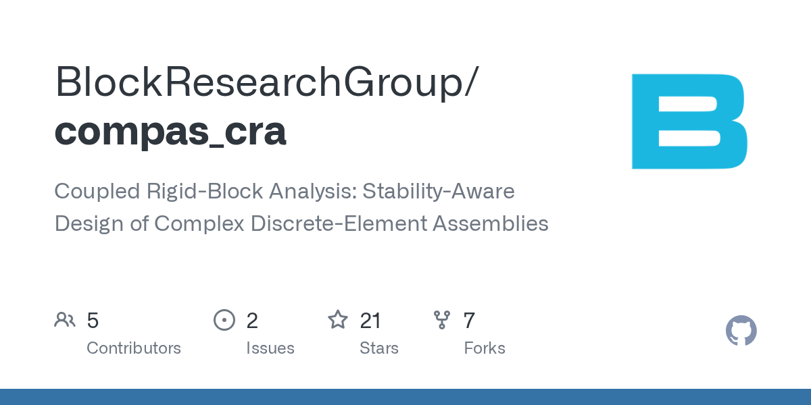

I am excited to open source our latest exciting research in Python — **[Coupled Rigid-Block Analysis (CRA)](/blog/coupled-rigid-block-analysis/)** for the COMPAS framework. CRA is a new method to measure structural stability statically and can be used to design complex discrete-element assemblies. It can be applied to many research fields like designing architecture, furniture, 3D puzzles, toys, or even robotic assembly planning.

You are welcome to use our code, star our repo, cite our work, and contribute!

- **Source code:** [github.com/BlockResearchGroup/compas_cra](https://github.com/BlockResearchGroup/compas_cra)
- **Documentation:** [blockresearchgroup.github.io/compas_cra](https://blockresearchgroup.github.io/compas_cra)

CRA is developed together with Philippe, Stelian, Tom, Bernhard, and Antonino. Our journal paper can be found in [*CAD Computer-Aided Design*](https://doi.org/10.1016/j.cad.2022.103216).

---

*Research from ETH Zürich — [Block Research Group](https://www.block.arch.ethz.ch/brg/), [NCCR Digital Fabrication](https://dfab.ch/), [Institute of Technology in Architecture](https://ita.arch.ethz.ch/), [Department of Computer Science (D-INFK)](https://inf.ethz.ch/)*
