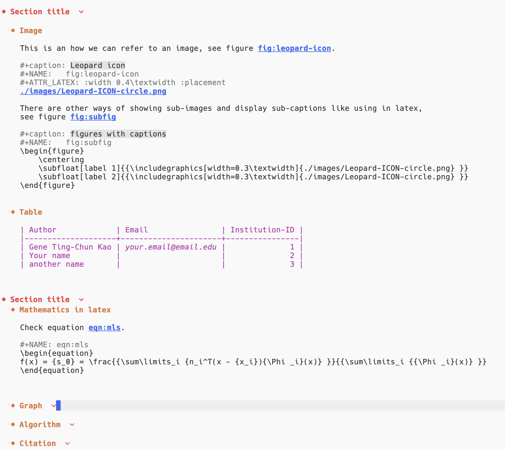
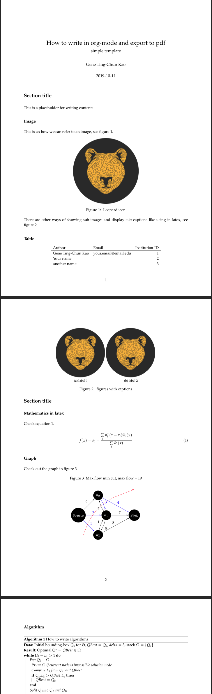

[<b>Emacs Org Mode</b>](https://orgmode.org/) is a perfect tool to do almost anything! I particularly like its slogan and design concept: [<b>Organize Your Life In Plain Text</b>](http://doc.norang.ca/org-mode.html)!

I use Org Mode for many things, which includes writing a to-do list, building a study plan, writing blog posts (including this one), scribbling documents to organise my thoughts (you can also run code in Org Mode, how cool is that!), and planning a research paper.

I would like to share my .org files with [LaTex](https://www.latex-project.org/) starter code and show how I use it to write research documents. Later I export them from .org file to .tex then to .pdf. I like this pipeline because I don't need to worry about the layout while writing. I can also combine many different syntaxes, such as latex in the .org file.

Here are some screenshots:

.org file


.pdf



# Table of Contents

1.  [My org-mode templates for latex-style writing](#org9a91d10)
2.  [Emacs settings](#orga3e0278)
3.  [Export from .org file to .pdf](#org1a80e12)


<a id="org9a91d10"></a>

# My org-mode templates for latex-style writing

[<b>This repo</b>](https://github.com/GeneKao/orgmode-latex-templates) contains different templates as a starter code to write org-mode which can later be exported to latex and pdf.


<a id="orga3e0278"></a>

# Emacs settings

I am using [Centaur Emacs](https://github.com/seagle0128/.emacs.d) for my emacs setting,
so if you encounter any different exporting result, please refer to the emacs setting and my [fork](https://github.com/GeneKao/.emacs.d) version (in the branch <b>gene-emacs</b>).

Or those lines to your .emacs setting file.

``` lisp
    (setq org-latex-pdf-process
          '("latexmk -pdflatex='pdflatex -interaction nonstopmode' -pdf -bibtex -f %f"))


    (unless (boundp 'org-latex-classes)
      (setq org-latex-classes nil))

    (add-to-list 'org-latex-classes
                 '("ethz"
                   "\\documentclass[a4paper,11pt,titlepage]{memoir}
    ...
    "))
```

<a id="org1a80e12"></a>

# Export from .org file to .pdf

Use the key combination

    C-c C-e l o

For more information, please refer to the [official documentation](https://orgmode.org/guide/LaTeX-and-PDF-export.html).
