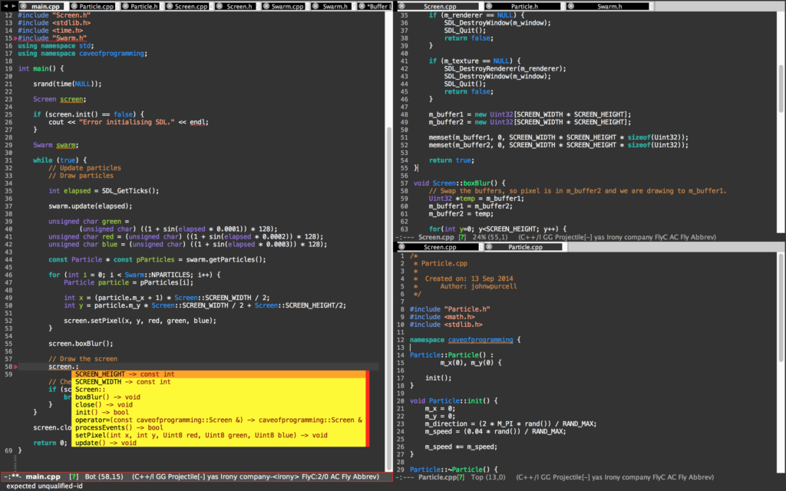

There are some modes I used to turn my emacs into a powerful IDE environment for c++, python and latex editing. So I post it here to share with anyone who might have interest in using emacs as main editor.

In my OS X, I have installed those packages and Lisp scripts including, <a href="https://melpa.org/" target="_blank">MELPA package manager</a>, <a href="https://www.gnu.org/software/auctex/" target="_blank">AUCTeX</a>, <a href="https://gist.github.com/soonhokong/7c2bf6e8b72dbc71c93b" target="_blank">irony-mode</a>, <a href="http://company-mode.github.io" target="_blank">company-mode</a>, <a href="https://github.com/nschum/highlight-symbol.el" target="_blank">highlight-symbol</a>, <a href="http://www.flycheck.org/en/latest/" target="_blank">flycheck</a>, <a href="https://github.com/hotpxl/company-irony-c-headers" target="_blank">company-irony-c-header</a>, <a href="http://auto-complete.org" target="_blank">auto-complete</a>, <a href="https://github.com/vspinu/ac-math" target="_blank">ac-math</a>, <a href="https://github.com/joaotavora/yasnippet" target="_blank">Yasnippet</a>, <a href="https://www.emacswiki.org/emacs/NeoTree" target="_blank">Neo Tree</a>,
<a href="https://melpa.org/#/company-auctex" target="_blank">company-auctex</a>, <a href="https://github.com/leoliu/ggtags" target="_blank">ggtags</a>, <a href="https://github.com/redguardtoo/cpputils-cmake" target="_blank">cpputils-camke</a>, <a href="https://github.com/proofit404/pyenv-mode" target="_blank">pyenv-mode</a>, <a href="https://github.com/proofit404/anaconda-mode" target="_blank">anaconda-mode</a>, <a href="https://www.languagetool.org" target="_blank">languagetool</a>

For more information about c++ IDE environment settings please see <a href="http://tuhdo.github.io/c-ide.html" target="_blank">this</a> amazing introduction.

<strong>Here is my emacs/aquamacs setting file:</strong>

(See the full settings in my dotfiles repository on GitHub.)
