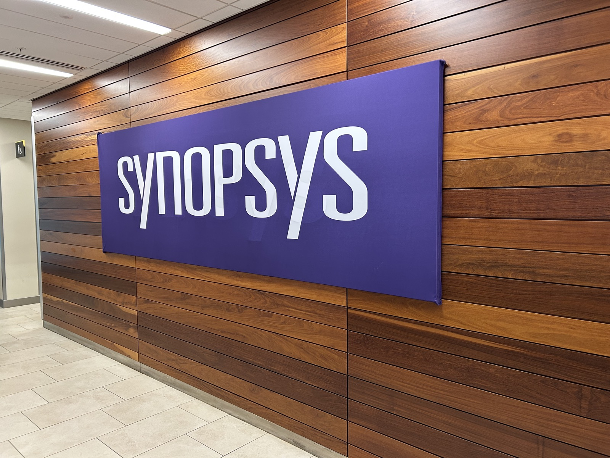

I started out in architecture, assuming I would eventually design buildings.

Somewhere along the way, that stopped being the most interesting part.

What stayed with me instead was a certain way of thinking: about geometry, structure, how things fit together. I've always been drawn to 3D geometry in particular; there's something about working in three dimensions that I find genuinely exciting. At some point I found myself more interested in how shapes are constructed and represented than in what the final design looked like.

That shift didn't happen all at once. It was gradual. I went to the ITECH program at the University of Stuttgart, initially still thinking in terms of architecture, but ended up spending more and more time on computational design and digital fabrication.

Later, during my PhD at ETH Zurich, this direction became more explicit. I was working on geometry, math, and optimisation in a structural context, and at the same time finding myself drawn further into the computational side. I picked up more computer science through a part-time program on the side, mostly because I felt I was missing some of the foundations.

Over time, the questions I cared about kept moving in the same direction: representation, discretization, mesh generation, and geometry processing. Less about designing shapes, more about how shapes are actually handled inside a system.

Today I work on computational geometry and meshing algorithms for engineering simulation software. In practice, that means working on the layer that sits somewhere between geometry and numerical analysis. The part that turns shapes into robust discrete representations a solver can use.

Looking back, this wasn't a planned transition. It was more a series of small shifts that accumulated over time.

Recently I was promoted to Staff Research and Development Engineer, which made me realize I've probably moved quite far from where I originally thought I would end up.

Happy geometry!
