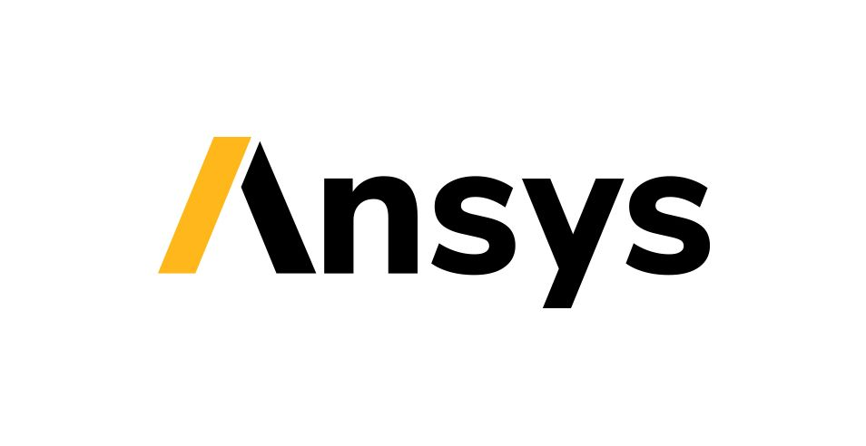

I'm happy to share that I'm starting a new position as **R&D Engineer II at Ansys**! I will be working in the Meshing Development Unit, focusing on **3D Geometry Processing** and **Computational Geometry** topics. I am incredibly excited to be part of a team dedicated to cutting-edge research and development in these fields.

After 4.5 wonderful years in Zürich — first at ETH Zürich pursuing my PhD on the stability assessment of discrete shell structures, and then defending it successfully in March 2023 — this move to **Stockholm** marks an exciting new chapter both professionally and personally.

At Ansys, I look forward to applying my background in computational geometry and geometric algorithms to real-world engineering simulation problems, contributing to tools that engineers and scientists rely on every day.

Onwards and upwards! 🚀
