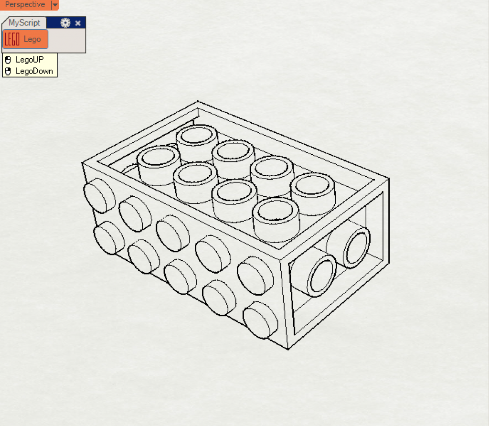
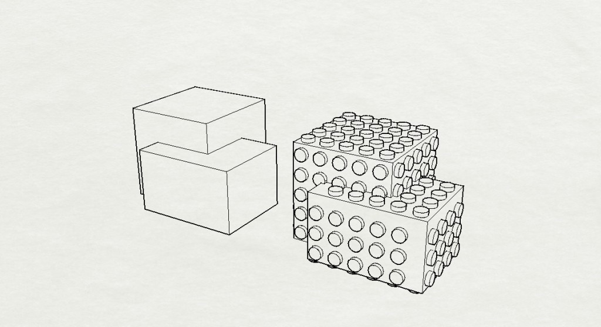

在Rhino3D軟體裡用python程式語言 創造客制化的樂高原件。

LEGO customised components developed through Python script using Rhino 3D software. We can design our own LEGO components via 3D printer.

- Mouse left click → make LEGO up part
- Mouse right click → make LEGO down part

**How it works:**

1. Replace any surface with a LEGO unit. Dimensions reference [here](https://upload.wikimedia.org/wikipedia/commons/1/1a/Lego_dimensions.svg).
2. Trim a hole.
3. Extrude surfaces.
4. Join all faces.
