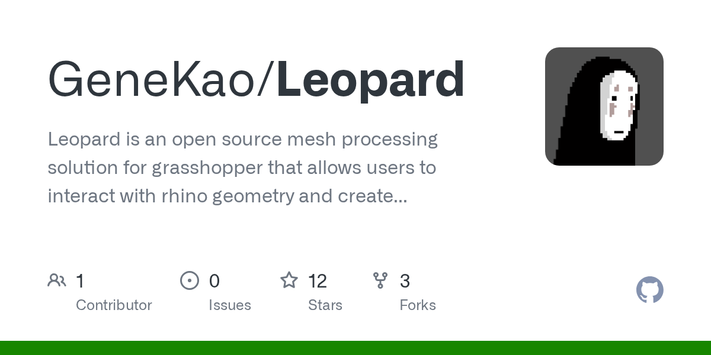

# Leopard - A new way to process mesh in Grasshopper, a cool GH plugin.

We are pleased to announce our new plugin for Grasshopper: "Leopard" http://www.grasshopper3d.com/group/leopard

Leopard is an open source mesh processing solution for grasshopper that allows users to interact with rhino geometry and create customised mesh shapes. By selecting Mesh vertices, edges and faces, users have more freedom to edit meshes intuitively and use different subdivision schemes to selectively choose multiple areas to fix.

Mesh data using Plankton for internal processing.

Leopard is still in the very early development stage, so please use it for your own risk and we welcome any feedback, discussion or insight you may provide.

Download:

http://www.food4rhino.com/app/leopard

https://github.com/GeneKao/Leopard/releases/tag/0.0.01a

First tutorial

<iframe width="100%" height="315" src="https://www.youtube.com/embed/OsuM5yi81Co" frameborder="0" allow="accelerometer; autoplay; encrypted-media; gyroscope; picture-in-picture" allowfullscreen></iframe>

Leopard © 2016-2020 Gene Ting-Chun Kao and Alan Song-Ching Tai
