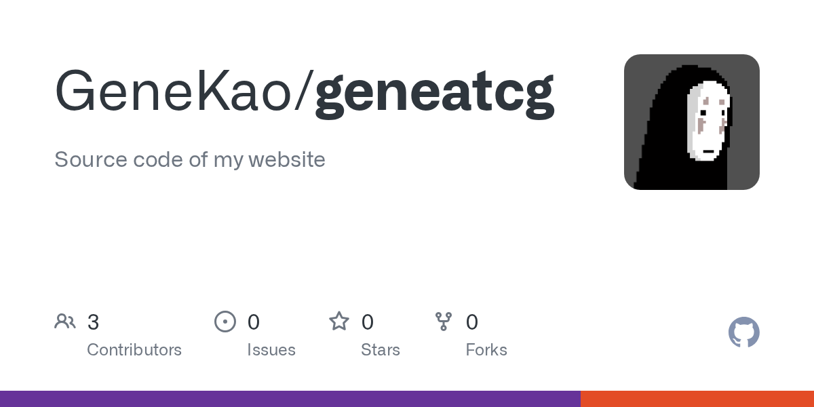

I am excited to share that this website is now open source! 🎉

**[github.com/GeneKao/geneatcg](https://github.com/GeneKao/geneatcg)**

## How it's built

The site is a static website built with [Hugo](https://gohugo.io/) and the [PaperMod](https://github.com/adityatelange/hugo-PaperMod) theme. I customised the homepage layout, added structured data pages for my resume, publications, and talks, and wired up a few CSS and layout overrides to make it feel like my own. Content lives in Markdown files, structured data in YAML, and everything deploys automatically to GitHub Pages via GitHub Actions on every push to `main`.

Before this, the site ran on [Lektor](https://www.getlektor.com/). I migrated to Hugo for its speed, rich ecosystem, and the clean aesthetic of PaperMod.

## What's included

- **Custom homepage** — cover hero, highlights grid, recent posts with thumbnails, and an about section
- **Structured data pages** — resume timeline, publication cards, and talk cards all driven by YAML files
- **Comments** via [giscus](https://giscus.app/) (GitHub Discussions), with automatic light/dark theme sync
- **Syntax highlighting** with separate light and dark Chroma themes
- **Cover image support** for external URLs (e.g. GitHub OG preview images)
- **Archives page** + tag browsing
- **Google Analytics** (GA4)
- **Automated deployment** to GitHub Pages via GitHub Actions
- **RSS feed** + JSON search index

## Why open source?

A few reasons:

- **Consistency.** This site is about sharing work and ideas — it felt right to also share how it is made.
- **Giving back.** I have learned so much from open-source projects. This is a small way to contribute.
- **Usefulness.** If someone building their own Hugo portfolio finds something here — a layout trick, a YAML pattern, a CSS fix — that makes it worthwhile.

The code is not a polished template, but it is honest and real. Feel free to explore, borrow ideas, or open an issue if you spot something broken.

## Building with AI

One thing worth mentioning: this site came together much faster than I expected, thanks to AI-assisted development. Using [Claude Code](https://claude.ai/code), I could iterate quickly across the whole stack — customising layouts, fixing CSS, migrating old content, adding new features — without getting stuck on the details. What might have taken weeks of trial and error was compressed into a handful of focused sessions.

If you have been putting off building your own site, there has never been a better time to start. The barrier is lower than ever.

## What's next

With a smooth publishing pipeline — write in Markdown, push to `main`, live in minutes — I am hoping to write more regularly going forward. The friction of getting something online is now low enough that there is no excuse not to share. Expect more posts on computational geometry, software, research, and the occasional life update. Stay tuned! 🚀
