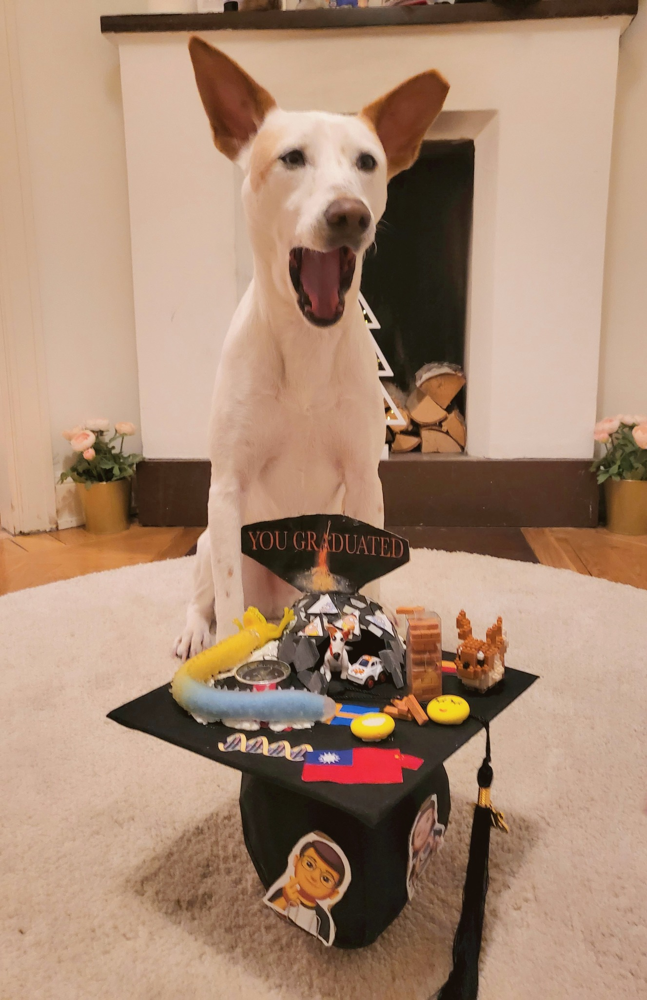
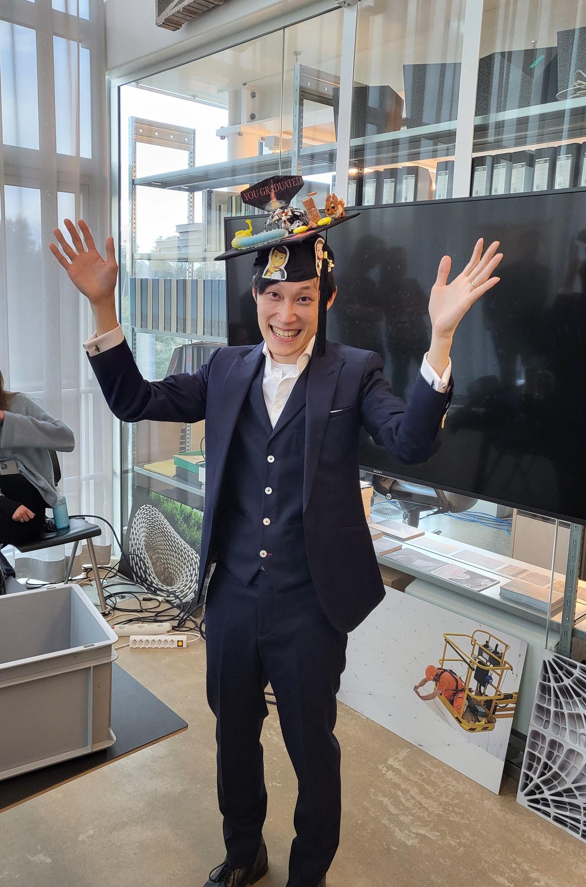
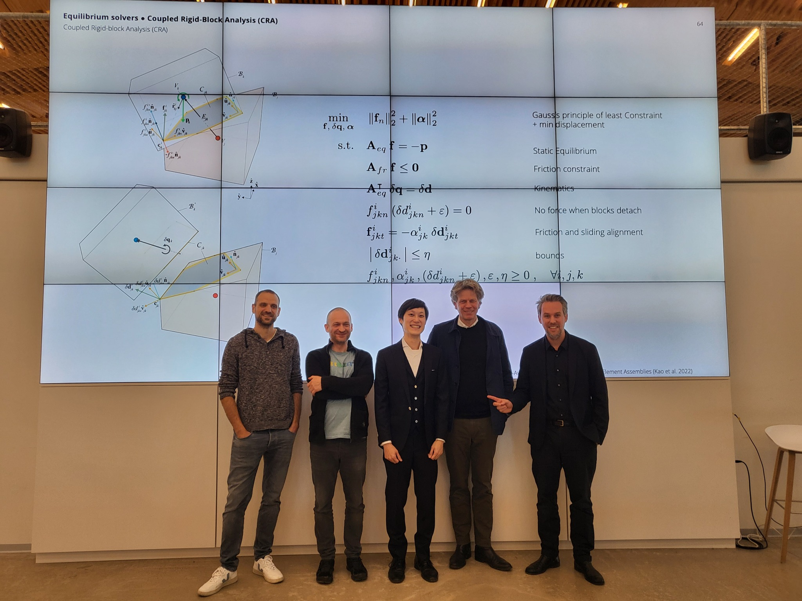

I am happy to share that I defended my PhD research at ETH Zürich last Thursday, March 9th! Many thanks to all my supervisors and reviewers — **Prof. Dr Philippe Block**, **Prof. Dr Stelian Coros**, **Dr Tom Van Mele**, and **Prof. Dr Jan Knippers** — for their endless support!

Time flies! It has been a wonderful 4.5 years since I joined the Block Research Group, ETH Zurich in September 2018. I gained rich experience, learnt so much knowledge, and overcame several challenges. I enjoyed doing advanced interdisciplinary research in NCCR Digital Fabrication and Institute of Technology in Architecture, ETH Zurich. I was also fascinated by the courses I took during my Computer Science CAS degree at D-INFK, ETH Zürich, parallel to my PhD studies.

I am grateful to my supervisor Philippe, co-supervisor Stelian, and senior scientist Tom, who are tremendously generous and supportive, and gave me advice full of wisdom and visionary insight with a lot of technical support. All of this helped me grow as an independent researcher.

I am thankful to all who worked with me and helped me during my PhD. Especially, Antonino gave me all kinds of support during and after the pandemic, my colleague Francesco always helped me, and I wish Matthias was still with us to see my accomplishment. I want to thank all my (ex) BRG family and students for inspiring me through their work. I want to thank all my friends and parents for chatting with me when I was down or lost. Most importantly, my wife Bonnie and doggy Genie for their endless mental support. Without all of you, I couldn't have finished my PhD.
