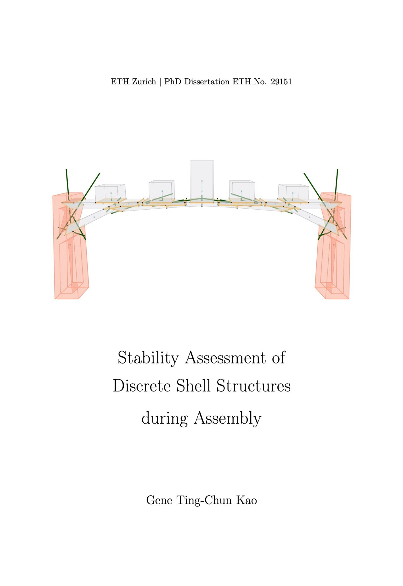

Finally! After a long journey, I now officially hold the title of Doctor of Sciences (Dr. sc. ETH Zürich). My PhD dissertation, titled **"Stability Assessment of Discrete Shell Structures during Assembly,"** is now available online and can be freely accessed.

[Read the dissertation →](https://doi.org/10.3929/ethz-b-000620646)

Thanks to my supervisors and reviewers: Philippe, Stelian, Tom, and Jan for their guidance. My family members Bonnie and Genie for their endless support. More thanks in the acknowledgement section of the thesis.
