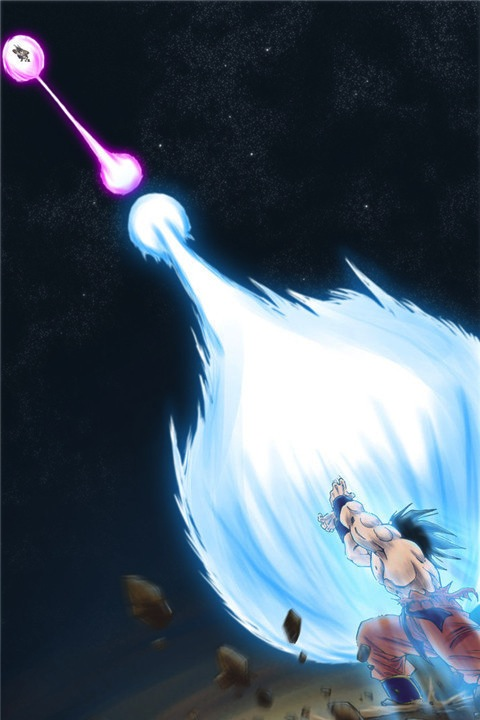
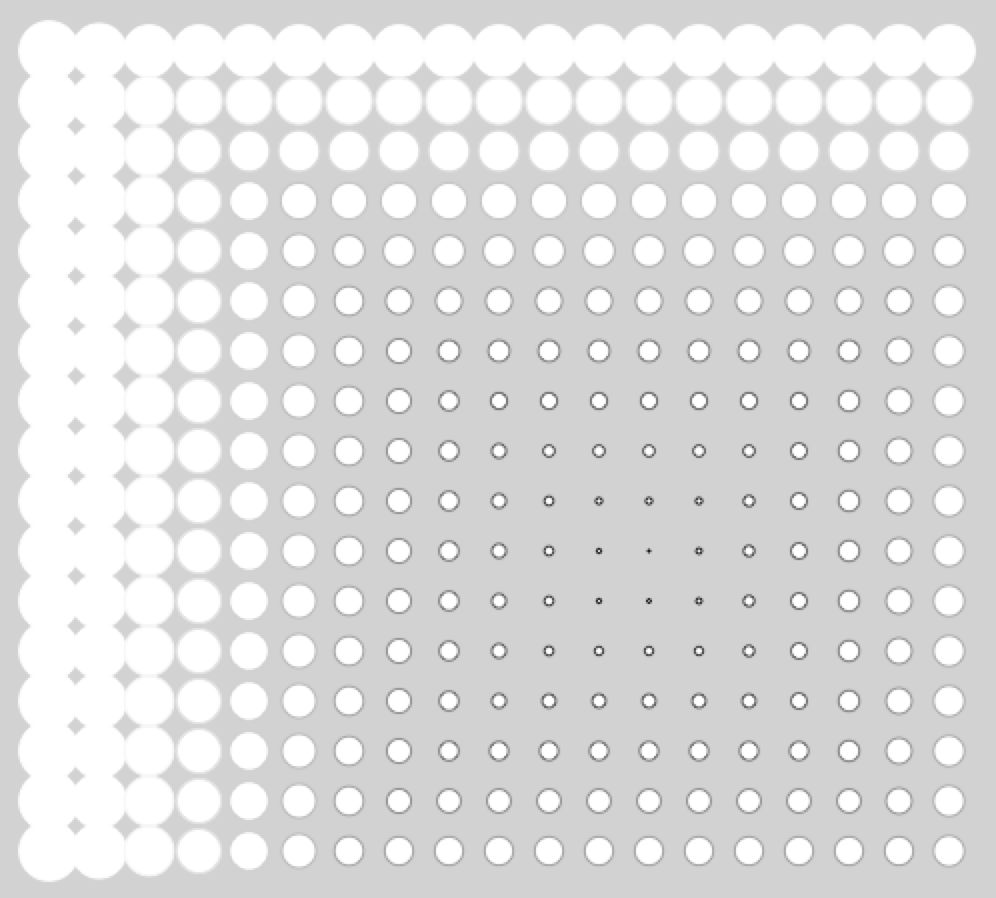
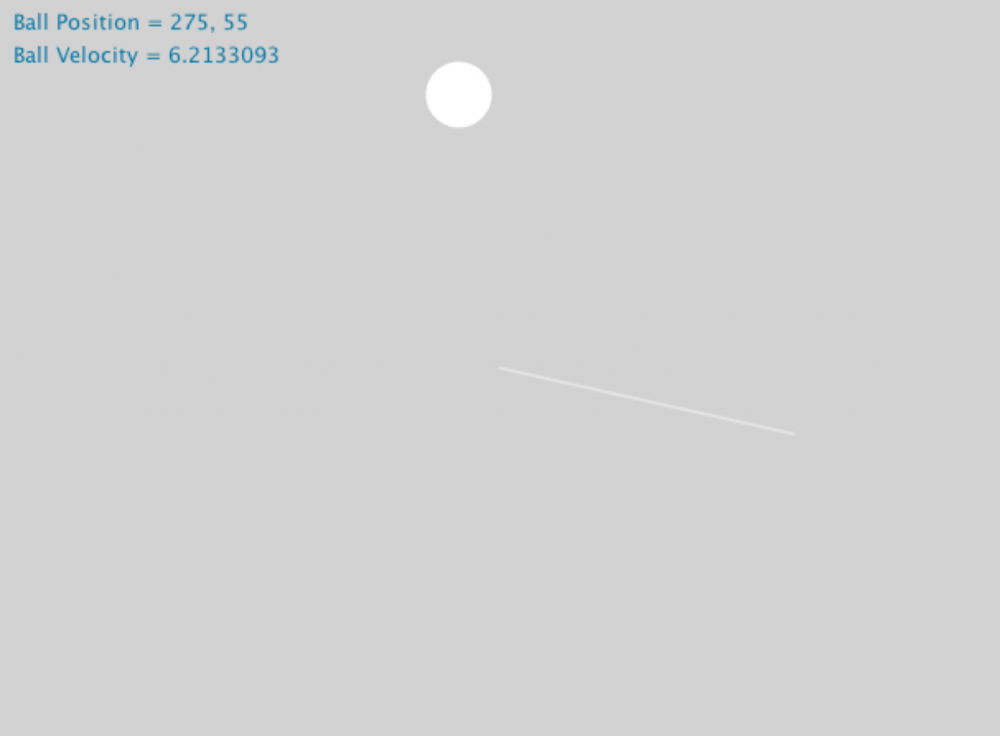
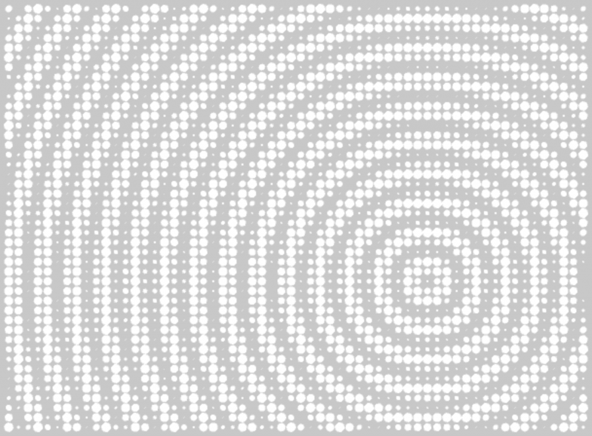
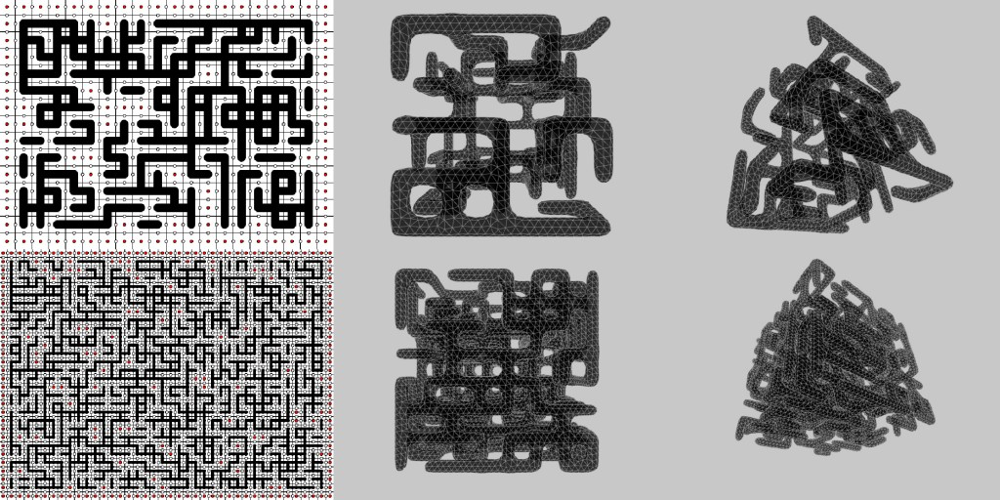
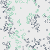

My Processing 101 creative coding experiments.

* [00 Kamehameha Simple](#processing-101--00-kamehameha-simple)
* [01 Attractor2DSimple](#processing-101--01-attractor2dsimple)
* [02 BouncingBallSimple](#processing-101--02-bouncingballsimple)
* [03 Wave](#processing-101--03-wave)
* [05 waterPipe](#processing-101--05-waterpipe)
* [06 TwoPlayersGA](#processing-101--06-twoplayersga)

---

## Processing 101 – 00 Kamehameha Simple



_Kamehameha_ かめはめ波 龜派氣功 instruction
1. Press you mouse left button.
2. Drag it in the opposite direction.
3. And you will find out it open fire automatically.

Dictionary: Kamehameha [かめはめ波](https://ja.wikipedia.org/wiki/%E3%81%8B%E3%82%81%E3%81%AF%E3%82%81%E6%B3%A2) 龜派氣功

Code Inspired From: [Processing.js learning Sample](http://processingjs.org/learning/)

```java
float radius = 50;
int X, Y;

void setup() {
  size( 650, 200 );
  strokeWeight(10);
  fill( 198, 81, 10);
  stroke(255);
  X = width/2;
  Y = height/2;
}

void draw() {
  background(100);
  radius += sin(frameCount/10);
  ellipse(X+=(X-pmouseX)/16, Y+=(Y-pmouseY)/16, radius, radius);
}

void mouseMoved() {
  X = mouseX;
  Y = mouseY;
}
```

## Processing 101 – 01 Attractor2DSimple



Attractor
Each circle on the grid points change its diameters, which based on distance between mouse position and point's location. Dictionary: [Attractor](https://en.wikipedia.org/wiki/Attractor) 吸引子，原本為複雜科學裡的一個專有名詞，近期廣被用來描述於Parametricism。 最先被運用在[Grasshopper](https://www.grasshopper3d.com/)裡頭。

```java
int space = 20;
int shiftX;
int shiftY;

void setup() {
  size(650, 450);
  smooth();
  shiftX = (width % space)/2;
  shiftY = (height % space)/2;
}

void draw() {
  background(200);

  for (float x = space-shiftX; x < width; x+=space) {
    for (float y = space-shiftY; y < height; y+=space) {

      line(x, 0, x, height);

      float rad = dist(mouseX, mouseY, x, y);
      stroke(rad, rad, rad);
      ellipse(x, y, rad/(1.5*space), rad/(1.5*space));
    }
  }
}
```

## Processing 101 – 02 BouncingBallSimple

### Bouncing Ball



When the shape hits the edge of the window, it reverses its direction. In this version, we assume that the bounce surface is hard (rigid), and that air resistance is negligible.

Dictionary: [Bouncing Ball](http://www.real-world-physics-problems.com/bouncing-ball-physics.html)

Code Inspired From:
[Processing/Examples/Bounce](https://processing.org/examples/bounce.html)

```java
Ball b;

void setup() {
  size(650, 450);
  //frameRate(20);
  smooth();
  b = new Ball(new PVector(width/2, height/2));
}

void draw() {
  background(200);
  b.draw();
}

void mousePressed() {
  b = new Ball(new PVector(width/2, height/2));
}

class Ball {

  PVector pos;
  PVector dir = new PVector(mouseX-width/2, mouseY-height/2);
  PVector vel;
  int rad = 20;

  Ball(PVector pos) {
    this.pos = pos;
    vel = PVector.div(dir, (width/2)/5);
  }

  void draw() {
    display();
    bound();
    run();
    fill(0, 102, 153);
    text("Ball Position = " + (int)pos.x + ", " + (int)pos.y, 10, 20);
    text("Ball Velocity = " + vel.mag(), 10, 40);
  }

  void bound() {
    if (pos.x > width-rad || pos.x < rad)
      vel.x *= -1;
    if (pos.y > height-rad || pos.y < rad)
      vel.y *= -1;
  }

  void run() {
    pos.add(vel);
  }

  void display() {
    fill(255);
    noStroke();
    ellipse(pos.x, pos.y, rad*2, rad*2);
    displayArrow();
  }

  void displayArrow() {
    strokeWeight(dist(width/2, height/2, mouseX, mouseY)/100);
    stroke(255, 100);
    line(width/2, height/2, mouseX, mouseY);
    stroke(255, 255, 0);
    fill(255, 255, 0, 100);
    ellipse(mouseX, mouseY, 20, 20);
    if (mousePressed) {
      stroke(255, 255, 0);
      fill(255, 255, 0);
      ellipse(mouseX, mouseY, 40, 40);
    }
  }
}
```

## Processing 101 – 03 Wave

### Wave



A Cosine Function is used in this small program. d = the distance between our mouse position and all points (grid). The radius of ellipse is positive with Cos(d). In the End, "t" is used as time parameter. Dictionary: Find out more mathematical function here: [The Beauty of Math](http://www.winosi.onlinehome.de/Gallery_t12.htm).

```java
int t = 0;
float z;

void setup() {
  size(650, 450, P2D);
  smooth();
  noStroke();
}

void draw() {
  background(200);

  for (int i = 10; i < width; i+= 10) {
    for (int j = 10; j < height; j+= 10) {
      float x = i/10;
      float y = j/10;
      float d = dist(mouseX/10, mouseY/10, x, y);
      //z = cos(sqrt( (x*x) + (y*y) /*- 0.5*t*/));
      z = cos(d - 0.2*t);
      ellipse(i, j, 10*z, 10*z);
    }
  }
  t++;
}
```

## Processing 101 – 05 waterPipe



```java
///////////////////////////////////////
/**************************************
 //www.geneatcg.com/

 Processing 101 - 05
 Wriiten by Gene Kao
 Date --- 2013/04/16

 **************************************/
///////////////////////////////////////


Pipe[][] grids;

int width = 650;
int height = 450;
int x = 20;
int y = 15;
int gridx = width/x;
int gridy = height/y;
int w = 15;

void setup() {

  size(width, height);
  smooth();
  background(200);
  rectMode(CENTER);
  frameRate(10);

  grids = new Pipe[2*x][2*y];

  for (int i = 0; i < 2*x-1; i++) {
    for (int j = 0; j < 2*y-1; j++) {
      if (i % 2 == 0 || j % 2 ==0) {
        PVector pos = new PVector(i*gridx/2+gridx/2, j*gridy/2+gridy/2);
        grids[i][j] = new Pipe(pos, i, j, false);
      }
      else {
        PVector o = new PVector(0, 0);
        grids[i][j] = new Pipe(o, i, j, false);
      }
    }
  }
  rand();
}

void draw() {

  background(200);

  for (int i = 0; i < 2*x-1; i++) {
    for (int j = 0; j < 2*y-1; j++) {
      if (i % 2 == 0 || j % 2 ==0) {
        if (i % 2 == 0 && j % 2 ==0) fill(255, 0, 0);
        else fill(255);
        strokeWeight(1);
        ellipse(grids[i][j].loc.x, grids[i][j].loc.y, 5, 5);

        if (i % 2 == 0 && j % 2 ==0) {

          strokeWeight(w);
          grids[i][j].testLeftUP();
        }
      }
    }
  }
}

void mousePressed() {
  startover();
  rand();
}


void rand() {
  for (int i = 0; i < 2*x-1; i++) {
    for (int j = 0; j < 2*y-1; j++) {
      if (i % 2 == 0 || j % 2 ==0) {
        if (i % 2 == 0 && j % 2 ==0) fill(255, 0, 0);
        else fill(255);
        if (i % 2 == 0 && j % 2 ==0) {

          grids[i][j].randomize();
        }
      }
    }
  }
}

void startover() {
  for (int i = 0; i < 2*x-1; i++) {
    for (int j = 0; j < 2*y-1; j++) {
      grids[i][j].initial();
    }
  }
}


class Pipe {

  PVector loc;
  int i;
  int j;
  boolean taken = false;

  Pipe(PVector loc, int i, int j, boolean taken) {
    this.loc = loc;
    this.i = i;
    this.j = j;
    this.taken = taken;
  }

  void starter() {
    if (i == 0 && j == 0) {
      if (random(1)>0.5) {
        grids[0][1].taken = true;
      }
      if (random(1)>0.5) {
        grids[1][0].taken = true;
      }
    }
  }

  void testLeftUP() {

    if ( ( i > 0 && j > 0 ) && (i<2*x-2 && j<2*y-2) ) {

      if (grids[i][j-1].taken == true) {
        line(loc.x, loc.y, grids[i][j-2].loc.x, grids[i][j-2].loc.y);
      }
      if (grids[i-1][j].taken == true) {
        line(loc.x, loc.y, grids[i-2][j].loc.x, grids[i-2][j].loc.y);
      }
    }
  }

  void randomize() {

    if ((j>0 && j < 2*y-2) && (i>0 && i < 2*x-2)) {

      if (random(1)>0.5) {
        grids[i][j+1].taken = true;
      }
      if (random(1)>0.5) {
        grids[i+1][j].taken = true;
      }
    }
  }

  void initial() {
    grids[i][j].taken = false;
  }
}
```

## Processing 101 – 06 TwoPlayersGA

### Two Players Game of Life First Test



Code refer to Mark Levene, George Roussos's Paper "[A Two-Player Game of Life](https://arxiv.org/abs/cond-mat/0207679v4)" For more basic Conway's Game of Life introduction please visit wiki [here](https://en.wikipedia.org/wiki/Conway's_Game_of_Life).

```java
///////////////////////////////////////
/**************************************
 //www.geneatcg.com/

 Processing 101 - 06
 Wriiten by Gene Kao
 Date --- 2014/07/26

 **************************************/
///////////////////////////////////////

int cols = 65*2;
int rows = 45*2;

GA ga[][] = new GA[cols][rows];

void setup() {

  size(650, 450);
  frameRate(20);
  noStroke();
  rectMode(CENTER);

  for (int i = 0; i < cols; i++) {
    for (int j = 0; j < rows; j++) {
      if (i > cols/2) {
        ga[i][j]= new GA(i, j, true);
      } else {
        ga[i][j]= new GA(i, j, false);
      }
    }
  }
}

void draw() {
  background(235);

  for (int i = 0; i < cols; i++) {
    for (int j = 0; j < rows; j++) {
      ga[i][j].run();
    }
  }

  for (int i = 0; i < cols; i++) {
    for (int j = 0; j < rows; j++) {
      ga[i][j].updateState();
    }
  }
}

void mousePressed() {
  for (int i = 0; i < cols; i++) {
    for (int j = 0; j < rows; j++) {
      if (i > cols/2) {
        ga[i][j]= new GA(i, j, true);
      } else {
        ga[i][j]= new GA(i, j, false);
      }
    }
  }
}

class GA {

  int x, y;
  PVector loc;
  boolean state, nexState;
  boolean team; // team true->white, false->black

  int above;
  int below;
  int left;
  int right;

  GA(int x, int y, boolean team) {

    this.x = x;
    this.y = y;
    this.team = team;

    if (random(2) > 1) {
      nexState = true;
    } else {
      nexState = false;
    }

    loc = new PVector((x+0.5)*(width/cols), (y+0.5)*(height/rows));

    setupState();
  }

  void run() {
    display();
    calcState();
    calcStateWhite();
    calcStateBlack();
  }

  void setupState() {
    above = (y+rows-1)%rows;
    below = (y+rows+1)%rows;
    left = (x+cols-1)%cols;
    right = (x+cols+1)%cols;

    if (above < 0)
      above = rows-1;
    if (below > rows)
      below = 0;
    if (left < 0)
      left = cols-1;
    if (right > cols)
      right = 0;
  }

  void updateState() {
    state = nexState;
  }

  void calcState() {

    int count = 0;

    if (ga[left][above].state==true) count++;
    if (ga[left][y].state==true) count++;
    if (ga[left][below].state==true) count++;
    if (ga[x][below].state==true) count++;
    if (ga[right][below].state==true) count++;
    if (ga[right][y].state==true) count++;
    if (ga[right][above].state==true) count++;
    if (ga[x][above].state==true) count++;


    if (state == true && count < 2)
      nexState = false;
    if (state == true && count <= 3 && count >=2)
      nexState = true;
    if (state == true && count > 3)
      nexState = false;
    if (state == false && count == 3)
      nexState = true;
  }

  void calcStateWhite() {

    if (team == true) {
      int countWhite = 0;
      int countBlack = 0;

      if (ga[left][above].state==true && ga[left][above].team==true) countWhite++;
      if (ga[left][y].state==true && ga[left][y].team==true) countWhite++;
      if (ga[left][below].state==true && ga[left][below].team==true) countWhite++;
      if (ga[x][below].state==true && ga[x][below].team==true) countWhite++;
      if (ga[right][below].state==true && ga[right][below].team==true) countWhite++;
      if (ga[right][y].state==true && ga[right][y].team==true) countWhite++;
      if (ga[right][above].state==true && ga[right][above].team==true) countWhite++;
      if (ga[x][above].state==true && ga[x][above].team==true) countWhite++;

      if (ga[left][above].state==true && ga[left][above].team==false) countBlack++;
      if (ga[left][y].state==true && ga[left][y].team==false) countBlack++;
      if (ga[left][below].state==true && ga[left][below].team==false) countBlack++;
      if (ga[x][below].state==true && ga[x][below].team==false) countBlack++;
      if (ga[right][below].state==true && ga[right][below].team==false) countBlack++;
      if (ga[right][y].state==true && ga[right][y].team==false) countBlack++;
      if (ga[right][above].state==true && ga[right][above].team==false) countBlack++;
      if (ga[x][above].state==true && ga[x][above].team==false) countBlack++;

      if (state == false) {
        if (countWhite == 3 && countBlack !=3)
          nexState = true;
        else if (countWhite == 3 && countBlack ==3) {
          nexState = true;
          if (random(2)>1) {
            team = true;
          } else {
            team = false;
          }
        } else if (countBlack >= 2) {
          team = false;
          state = false;
        }
      }
      if (state == true) {
        if (countWhite-countBlack == 2 || countWhite-countBlack== 3) {
          nexState = true;
        } else if (countWhite-countBlack == 1 && countWhite >= 2) {
          nexState = true;
        } else {
          nexState = false;
        }
      }
    }
  }

  void calcStateBlack() {

    if (team == false) {
      int countWhite = 0;
      int countBlack = 0;

      if (ga[left][above].state==true && ga[left][above].team==true) countWhite++;
      if (ga[left][y].state==true && ga[left][y].team==true) countWhite++;
      if (ga[left][below].state==true && ga[left][below].team==true) countWhite++;
      if (ga[x][below].state==true && ga[x][below].team==true) countWhite++;
      if (ga[right][below].state==true && ga[right][below].team==true) countWhite++;
      if (ga[right][y].state==true && ga[right][y].team==true) countWhite++;
      if (ga[right][above].state==true && ga[right][above].team==true) countWhite++;
      if (ga[x][above].state==true && ga[x][above].team==true) countWhite++;

      if (ga[left][above].state==true && ga[left][above].team==false) countBlack++;
      if (ga[left][y].state==true && ga[left][y].team==false) countBlack++;
      if (ga[left][below].state==true && ga[left][below].team==false) countBlack++;
      if (ga[x][below].state==true && ga[x][below].team==false) countBlack++;
      if (ga[right][below].state==true && ga[right][below].team==false) countBlack++;
      if (ga[right][y].state==true && ga[right][y].team==false) countBlack++;
      if (ga[right][above].state==true && ga[right][above].team==false) countBlack++;
      if (ga[x][above].state==true && ga[x][above].team==false) countBlack++;

      if (state == false) {
        if (countWhite != 3 && countBlack ==3)
          nexState = true;
        else if (countWhite == 3 && countBlack ==3) {
          nexState = true;
          if (random(2)>1) {
            team = true;
          } else {
            team = true;
          }
        } else if (countWhite >= 2) {
          team = true;
          state = true;
        }
      }
      if (state == true) {
        if (countBlack-countWhite == 2 || countBlack-countWhite == 3) {
          nexState = true;
        } else if (countBlack-countWhite == 1 && countBlack >= 2) {
          nexState = true;
        } else {
          nexState = false;
        }
      }
    }
  }

  void display() {

    if (state == true) {
      if (team == true) {
        fill(28, 47, 67, 160);
        rect(loc.x, loc.y, 10/2, 10/2);
      } else {
        fill(64, 187, 128, 150);
        ellipse(loc.x, loc.y, 10/2, 10/2);
      }
    }
  }
}
```
