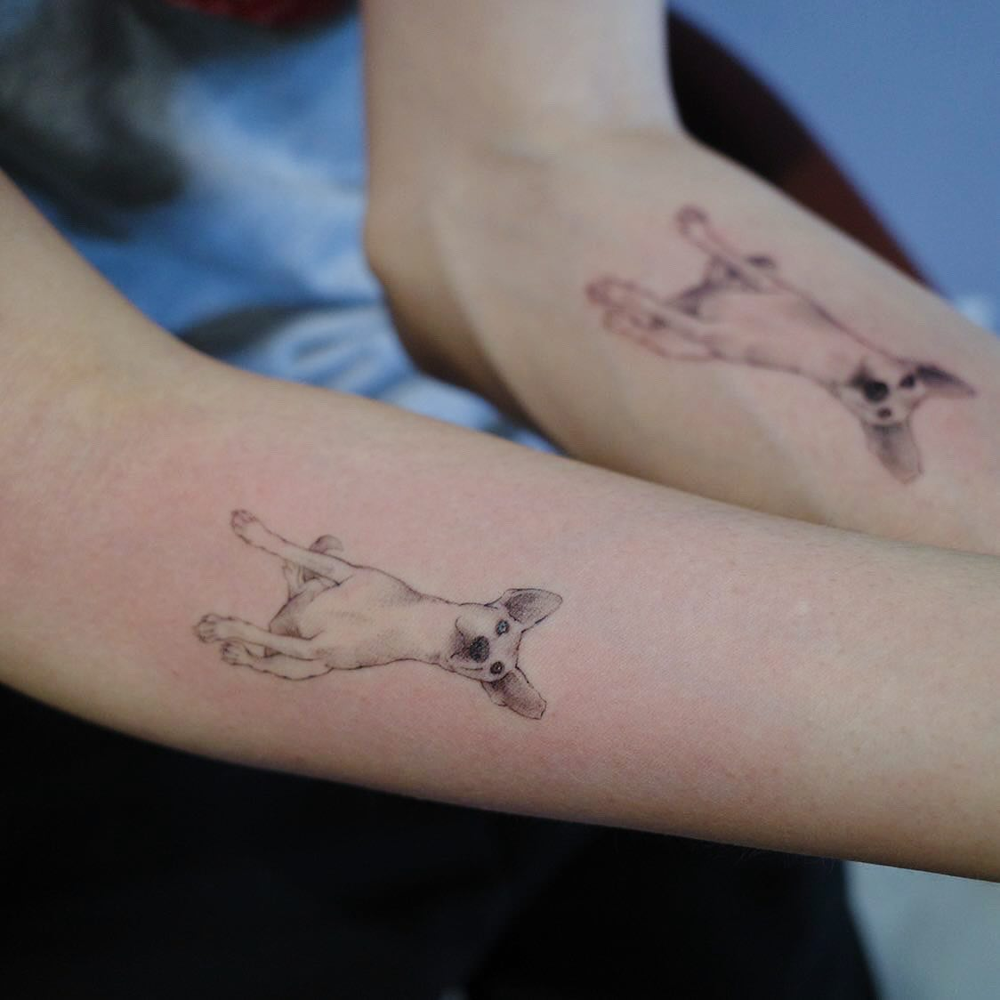
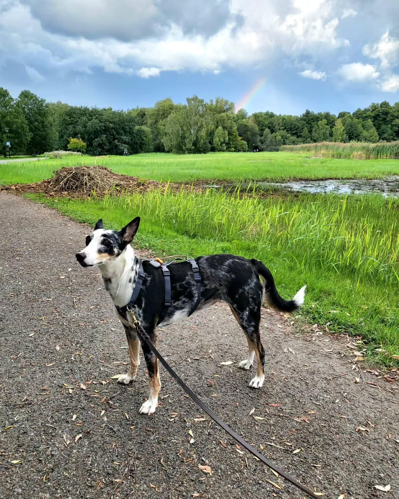

One year ago, we experienced something unimaginable: our beloved Genie left us. The shock and feeling of helplessness were too overwhelming. From his happy morning jumps to his sudden collapse in the park across from our home, we never expected that night would be without him. Maybe it was the sudden departure, or perhaps it was because he was only three years old, and we always felt there were so many more enjoyable moments we could experience together. But regardless of the reasons, the sadness and the suffocating feeling were indescribable, and everything seemed meaningless without him around.

To some, Genie was just a pet. Our time together was only 14 months, so they may not fully comprehend the level of devastation we are experiencing. Yet, one said: *'Grief is the price for love.'* The more love we give, the greater the grief we experience when that love is gone.

Genie was the first dog my wife and I welcomed into our lives. His wonderful personality was a gift, teaching us about the unexpected intelligence and kindness that dogs possess. He brought happiness and warmth into every moment. During the final year of my doctoral studies, his constant companionship was invaluable. He was more than a pet; he was my pillar of strength, my therapy dog. Without him, my achievements would have been unattainable.

A friend once said, *'Sadness is one thing, but when we are ready, we should have another dog who needs a home.'* About six months ago, we adopted Ebon, who was seriously abused but rescued. Her personality is distinct from Genie's, yet equally remarkable. Together, we continue to learn, heal, and grow.

---

A year has passed since Genie's departure, and thoughts of him still bring a wave of sadness. Time teaches us to adapt and live with the sadness rather than overcome it. I hope those who have lost beloved pets can find the courage to extend their love to another pet who needs a home. Ebon is not Genie, nor could she ever replace him in my heart, but I believe Genie would be happy to share the family that was once his. He would want us to share the love we couldn't give him with Ebon or any future dogs — because he was a free and beautiful soul.
