These are my Rhino.Python practice while I studied at Stuttgart University.

* [Rhino.Python - 1D 2D 3D](#rhinopython---1d-2d-3d)
* [Rhino.Python - Swarm bridge](#rhinopython---swarm-bridge)
* [Rhino.Python - tessellation and subdivision](#rhinopython---tessellation-and-subdivision)
* [Rhino.Python - Boy Surface and subdivision](#rhinopython---boy-surface-and-subdivision)

---

## Rhino.Python - 1D 2D 3D

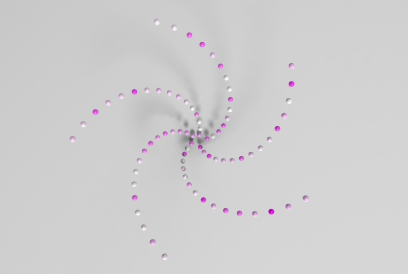

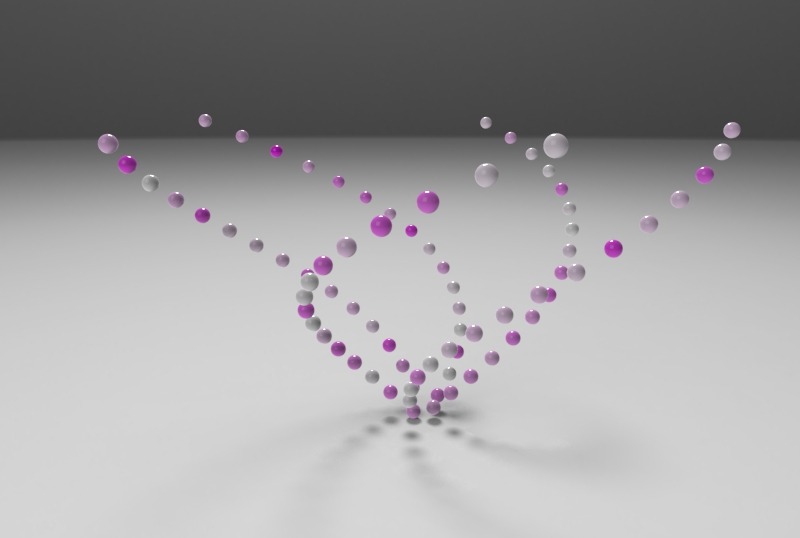

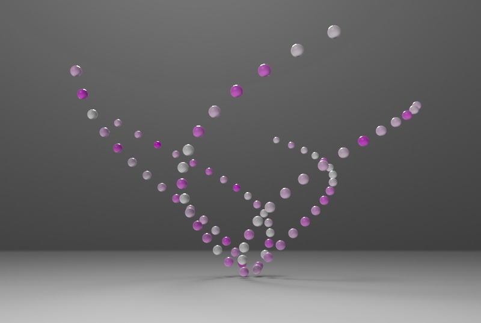

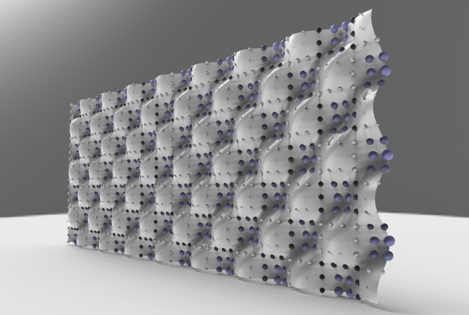

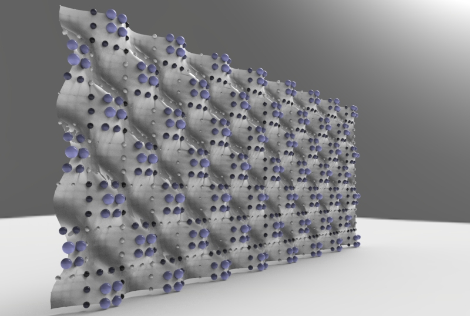

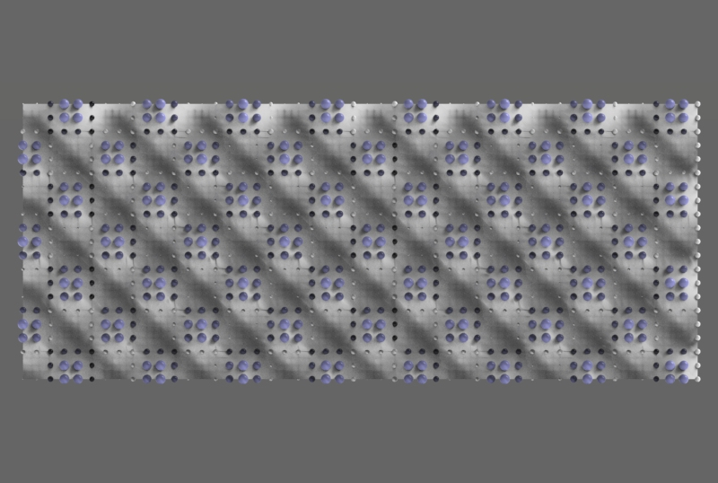

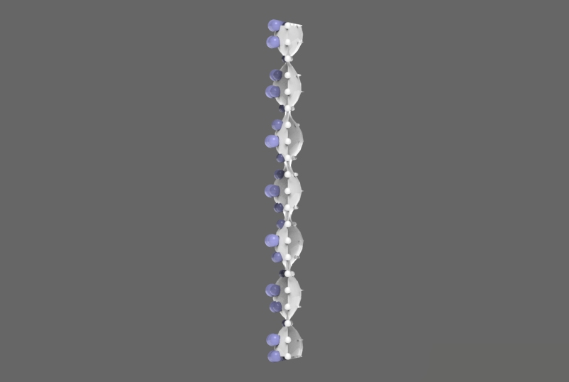

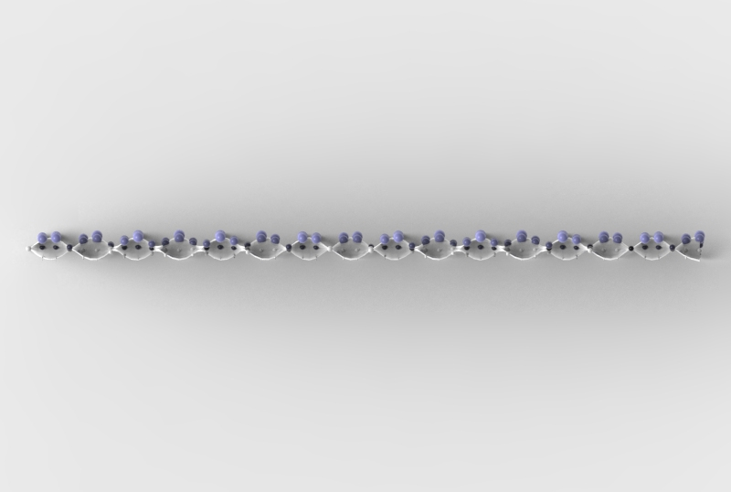

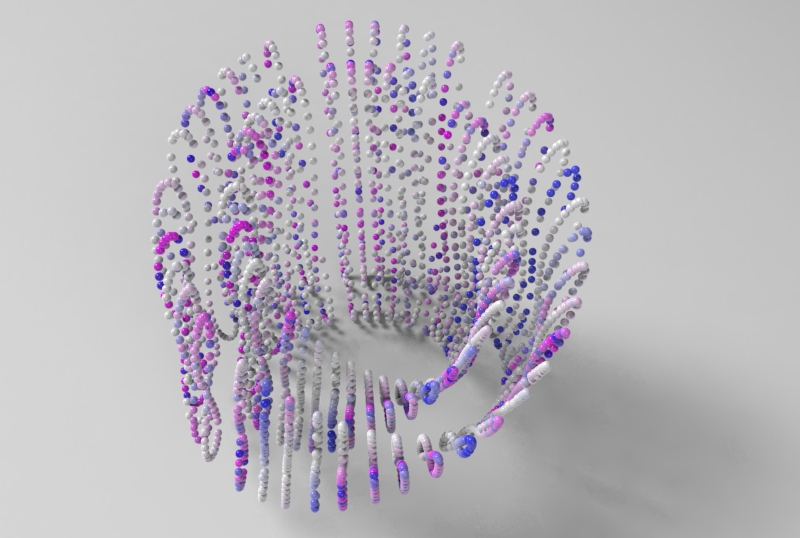

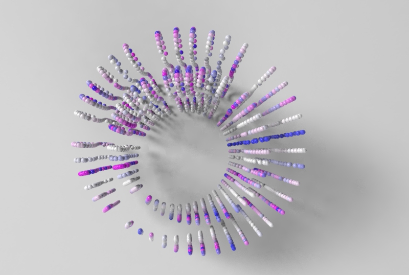

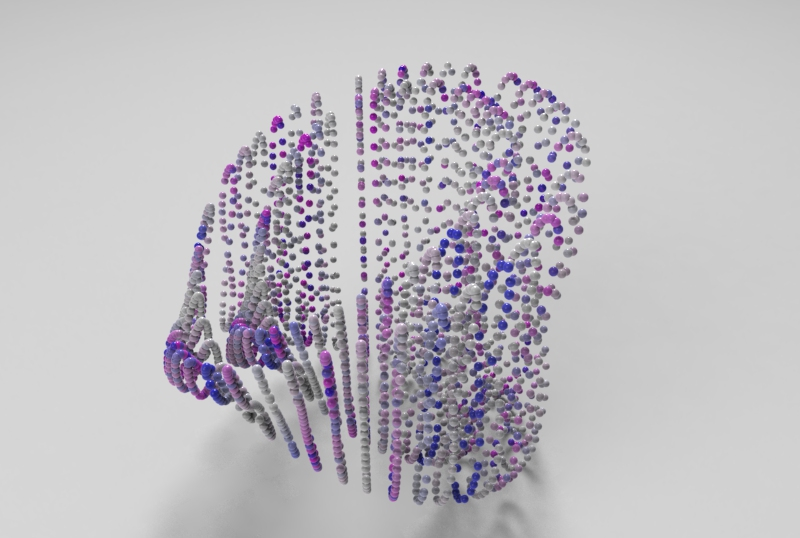

```python
"""
####################################################################
Computational Design Assignment 02
Kao, Ting-Chun
Assignment to use for loop
####################################################################
"""

from scriptcontext import doc, escape_test
import rhinoscriptsyntax as rs
import Rhino.Geometry as rg
import Rhino.DocObjects as rd
import Rhino
import time
import System.Guid as guid
import System.Drawing as sd
import math
import random

dimension = rs.GetInteger("give me one to three dimension: ", 2, 1, 3)
print(dimension)
# some functions
def PtMat(x, y, z):
    pt = rg.Point3d(x, y, z)
    materialIndex = doc.Materials.Add()
    material = doc.Materials[materialIndex]
    if dimension == 2:
        if x > 0 and y>0 and z>0:
            material.DiffuseColor = sd.Color.FromArgb(y/5*255*0.5, y/5*255*0.5, y/5*255)
    else:
        material.DiffuseColor = sd.Color.FromArgb( 255, abs(math.sin(x))*255, 255)
    material.CommitChanges()
    attr = Rhino.DocObjects.ObjectAttributes()
    attr = rd.ObjectAttributes()
    attr.MaterialSource = Rhino.DocObjects.ObjectMaterialSource.MaterialFromObject
    attr.MaterialIndex = materialIndex
    if dimension == 2:
        sphere = rg.Sphere(pt, (y+5)/5)
    elif dimension == 3:
        sphere = rg.Sphere(pt, 0.2)
    else:
        sphere = rg.Sphere(pt, 2)
    if doc.Objects.AddPoint(pt, attr) != guid.Empty:
        doc.Objects.AddSphere(sphere, attr)
    return pt

def noneLoopPt():
    pt = PtMat(i*math.sin(5*i), i*math.cos(5*i), i)
    return pt

def oneLoopCrv():
    pts = []
    for x in range(50):
        y = math.sin(x) * math.sin(i)
        pts.append(PtMat(5*x, 5*y, 5*i))
    crv = rs.AddCurve(pts)

    return crv

def twoLoopCrv():
    pts = []
    crvs = []
    for x in range(30):
        for y in range(40):
            a = ( i + math.cos(x/2)*math.sin(y) - math.sin(x/2)*math.sin(2*y) ) * math.cos(x)
            b = ( i + math.cos(x/2)*math.sin(y) - math.sin(x/2)*math.sin(2*y) ) * math.sin(x)
            c = 10*math.sin(x/2)*math.sin(y) - math.cos(x/2)*math.sin(2*y)
            pts.append(PtMat(a, b, c))
        crv = rs.AddCurve(pts)
    crvs.append(crv)
    return crvs

def threeLoopSrf():
    # haven't getten any idea to having a good one.
    return 0

def drawTime():
    FPS = 30
    last_time = time.time()

    # setup variables
    global i
    i = 3
    curves = []
    pts = []
    # whatever the loop is...
    while True:
        # draw animation
        if dimension == 3:
            i += 3
        else:
            i += 1
        # pause so that the animation runs at 30 fps
        new_time = time.time()
        # see how many milliseconds we have to sleep for
        # then divide by 1000.0 since time.sleep() uses seconds
        sleep_time = ((1000.0 / FPS) - (new_time - last_time)) / 1000.0
        if sleep_time > 0:
            time.sleep(sleep_time)
        last_time = new_time

        if dimension == 2:
            crv = oneLoopCrv()
            curves.append(crv)
            if i > 20:
                rs.AddLoftSrf(curves)
                break
        elif dimension == 3:
            curves = twoLoopCrv()
            escape_test()
        else:
            pt = noneLoopPt()
            pts.append(pt)
            if i > 80:
            #rs.AddLoftSrf(curves)
                rs.AddCurve(pts)
                break
    escape_test()

def main():
    drawTime()

if __name__ == "__main__":
    main()
```

---

## Rhino.Python - Swarm Bridge

Swarm Behavior + Attractor : Agent methods: 1. Align : Move in the same direction as your neighbours. 2. Cohesion : Remain close to your neighbours. 3. Seperation : Avoid collisions with your neighbours. Attractor methods: (Controlling the shape) From starting points move to target points to create bridge. Using swarm simulation in Grasshopper is in this post: Swarm Python GH Component

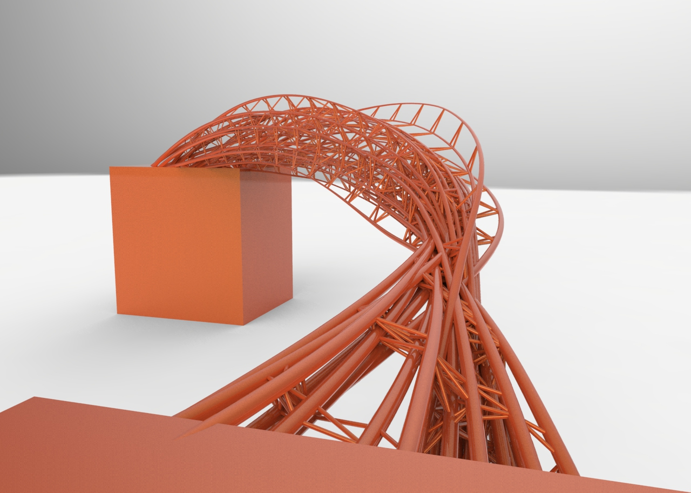

<iframe src="//www.youtube.com/embed/Vl4k08GAAzU?list=UUXVRZ5CbwNMhPv5l894U8jw" width="100%" height="480" frameborder="0" allowfullscreen="allowfullscreen"></iframe>

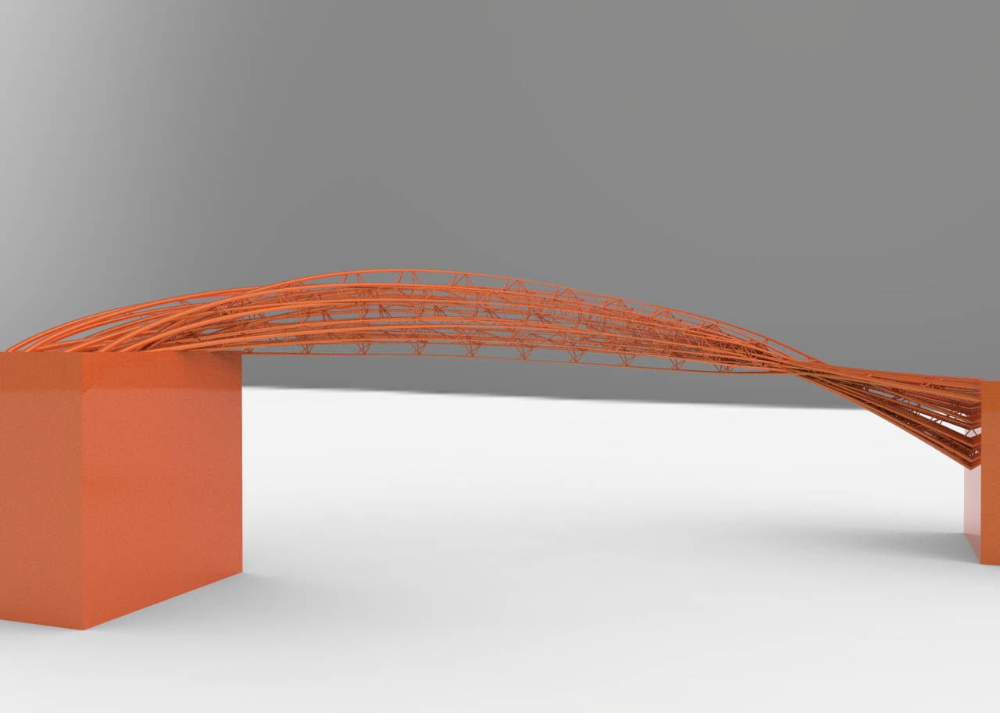

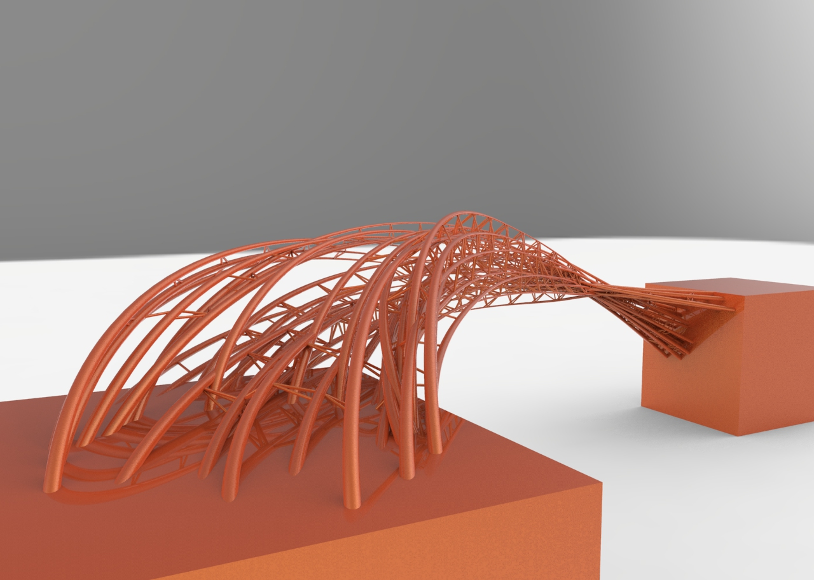

```python
import rhinoscriptsyntax as rs
import Rhino as rc
import time
import math
import scriptcontext as rc
import Rhino.Geometry as rg
from scriptcontext import escape_test
from random import *

rectX = 600
rectY = 600

class Runner:
    def __init__(self, p, v):
        self.p = p
        self.v = v
        self.a = rs.VectorCreate( (0,0,0),(0,0,0) )
        self.ptList = []

    def ptRun(self):
        self.v = rs.VectorAdd(self.v, self.a)
        v = rs.VectorLength(self.v)
        if v > 15:
            self.v = rs.VectorScale(rs.VectorUnitize(self.v), 15)
        self.p = rs.VectorAdd(self.p, self.v)
        self.a = rs.VectorCreate( (0,0,0),(0,0,0) )

        self.ptList.append(self.p)

    def flock(self):
        self.separate(4.0)
        self.cohesion(0.001)
        self.align(0.1)

        self.attractor(0.7)

    def align(self, mag):

        steer = rs.VectorCreate( (0,0,0) , (0,0,0) )
        count = 0

        for i in pts:
            distance = rs.Distance(i.p, self.p)
            if distance > 0 and distance < 40:
                steer = rs.VectorAdd(steer, i.v)
                count += 1

        if count>0:
            steer = rs.VectorScale(steer, 1.0/count)

        steer = rs.VectorScale(steer, mag)
        self.a = rs.VectorAdd(self.a, steer)

    def cohesion(self, mag):

        sum = rs.VectorCreate( (0,0,0) , (0,0,0) )
        count = 0

        for i in pts:
            distance = rs.Distance(i.p, self.p)
            if distance > 0 and distance < 60:
                sum = rs.VectorAdd(sum, i.p)
                count += 1

        if count>0:
            sum = rs.VectorScale(sum, 1.0/count)

        steer = rs.VectorSubtract(sum, self.p)
        steer = rs.VectorScale(steer, mag)
        self.a = rs.VectorAdd(self.a, steer)

    def separate(self, mag):

        steer = rs.VectorCreate( (0,0,0) , (0,0,0) )
        count = 0

        for i in pts:
            distance = rs.Distance(i.p, self.p)
            if distance > 0 and distance < 30:
                diff = rs.VectorSubtract(self.p, i.p)
                diff = rs.VectorUnitize(diff)
                diff = rs.VectorScale(diff, 1.0/distance)

                steer = rs.VectorAdd(steer , diff)
                count += 1

        if count>0:
            steer = rs.VectorScale(steer, 1.0/count)

        steer = rs.VectorScale(steer, mag)
        self.a = rs.VectorAdd(self.a, steer)

    def attractor(self, mag):

        attrPt = rs.VectorCreate((-800,-700,0) , (0,0,0))
        steer = rs.VectorCreate( (0,0,0) , (0,0,0) )
        diff = rs.VectorSubtract( attrPt, self.p )
        diff = rs.VectorUnitize(diff)

        steer = rs.VectorAdd(steer , diff)
        steer = rs.VectorScale(steer, mag)

        self.a = rs.VectorAdd(self.a, steer)

    def drawLines(self):
        for i in pts:
            distance = rs.Distance(i.p, self.p)
            if distance < 40 and distance > 0:
                pt1 = rg.Point3d(i.p[0], i.p[1], i.p[2])
                pt2 = rg.Point3d(self.p[0], self.p[1], self.p[2])
                lns.append(rs.AddLine(pt1, pt2))

    def drawPt(self):
        pt = rs.AddPoint(self.p[0], self.p[1], self.p[2])
        return pt

def setup():
    global pts
    pts = []
    global lns
    lns = []
    numAG = 36

    for i in range(numAG):
        p = rs.VectorCreate( rs.AddPoint( 100*math.cos(i*2*math.pi/numAG), 100*math.sin(i*2*math.pi/numAG),0) , rs.AddPoint(0,0,0) )
        v = rs.VectorCreate(   rs.AddPoint( -randint(2,18),-randint(18,36),randint(-2,26)   )  ,  rs.AddPoint(0,0,0  )    )
        run1 = Runner(p, v)
        pts.append(run1)

def run():
    pos = []
    vec = []

    for i in pts:
        pos.append(i.drawPt())
        vec.append(i.v)
    for i in pts:
        i.flock()
        i.ptRun()
        if t > 10 and t%6==1:
            i.drawLines()

def drawTime():
    FPS = 30
    last_time = time.time()
    global t
    t = 0
    curves = []
    # whatever the loop is...
    while True:
        # draw animation
        t += 1
        # pause so that the animation runs at 30 fps
        new_time = time.time()
        # see how many milliseconds we have to sleep for
        # then divide by 1000.0 since time.sleep() uses seconds
        sleep_time = ((1000.0 / FPS) - (new_time - last_time)) / 1000.0
        if sleep_time > 0:
            time.sleep(sleep_time)
        last_time = new_time

        run()

        print t

        if t > 108:
            for k in pts:
                curves.append(rs.AddCurve(k.ptList))

            rs.EnableRedraw(False)
            for crv in curves:
                rs.AddPipe(crv, [0,0.5,1], [4,1,4], cap=2)

            for ln in lns:
                rs.AddPipe(ln, 0, 1, cap=2)
            rs.EnableRedraw(True)
            break

        escape_test()

def main():
    setup()
    drawTime()

if __name__ == "__main__":
    main()
```

---

## Rhino.Python - Tessellation and Subdivision

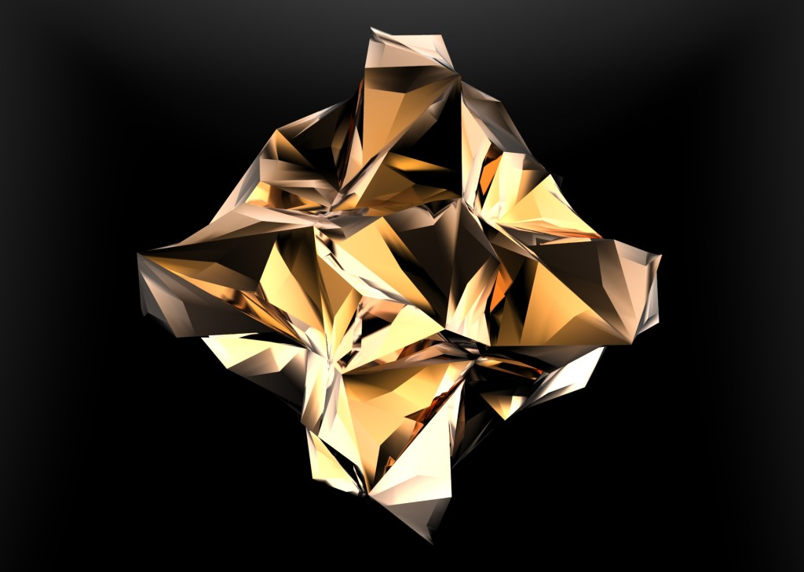

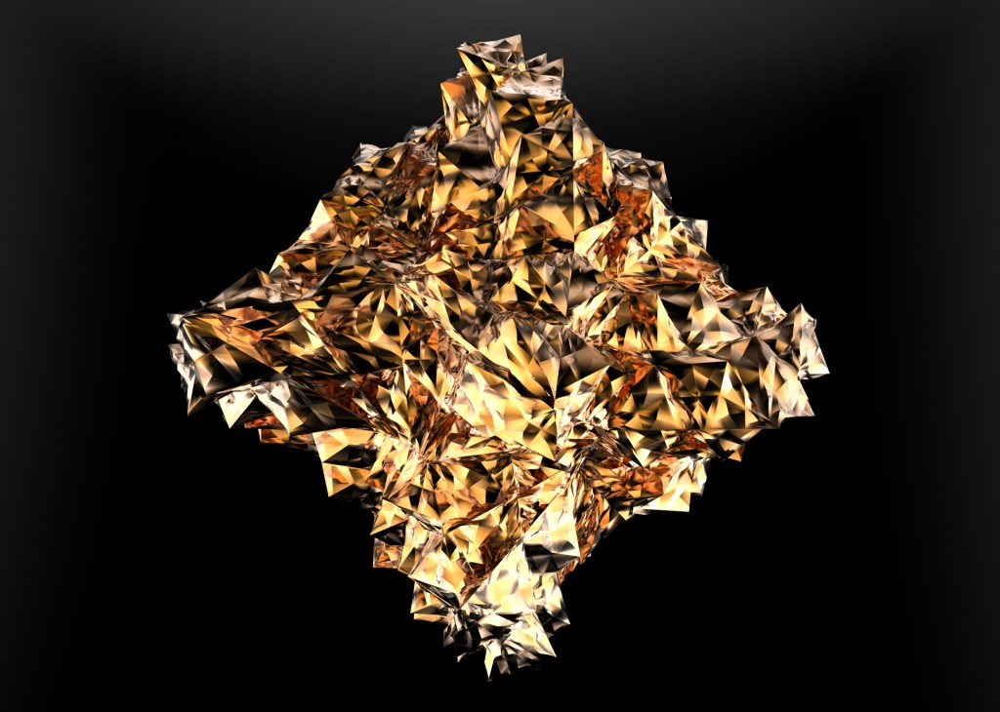

Using recursive loop and drawing to tessellate and subdivide surfaces. Warning: This is only the rough first version so contain lots of problems and bugs. Use it carefully, otherwise it will crash your computer. A lot of problem need to be solved. Problem: The dirction and orientation of subdivision faces should be organized. Using surface is not an efficient way. Should turn surfaces into meshes.

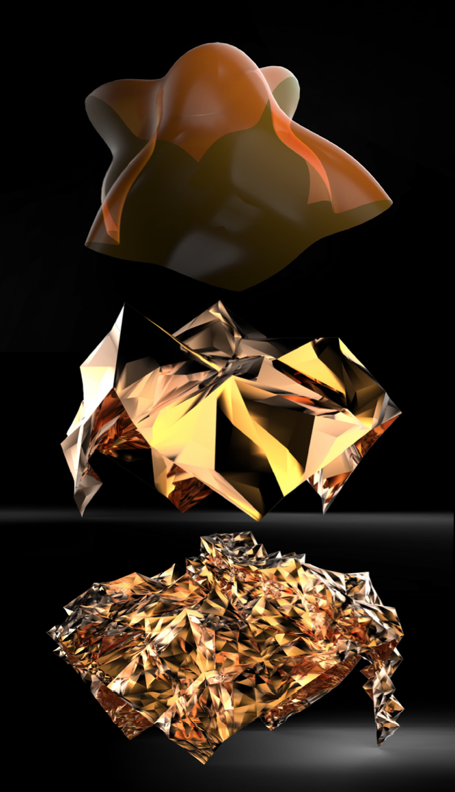

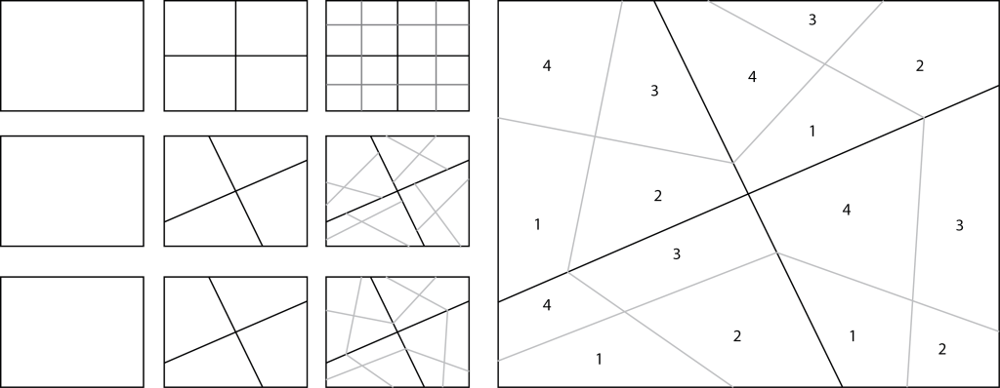

### diagram

```python
"""
####################################################################
Computational Design Assignment 04
Tessellation and Subdivision

Written by:
Gene Ting-Chun Kao

This is only the rough first version so contain lots of problems and bugs.
Use it carefully, otherwise it will crash your computer.

problem:
The dirction and orientation of subdivision faces should be organized.
Using surface is not a good way. Should turn surfaces into meshes.

####################################################################
"""

import rhinoscriptsyntax as rs
import Rhino as rh
import math
import Rhino.Geometry as rg
from scriptcontext import escape_test
from scriptcontext import doc
from random import *

def DivideSrfUV(srf, dividU, dividV):
    """
    Divid surface method
    return: uv vector
    uv position using vector, so uv can be calculate later.
    """
    domainU = rs.SurfaceDomain(srf, 0)
    domainV = rs.SurfaceDomain(srf, 1)
    uStep = (domainU[1]-domainU[0])/dividU
    vStep = (domainV[1]-domainV[0])/dividV

    uvList = []
    for i in range(dividU+1):
        u0 = domainU[0] + uStep*i
        if i < (dividU):
            u1 = domainU[0] + uStep*(i+1)
            for j in range(dividV+1):
                v0 = domainV[0] + vStep*j
                if j < (dividV):
                    v1 = domainV[0] + vStep*(j+1)
                    vec00 = rg.Vector3d(u0,v0,0)
                    vec01 = rg.Vector3d(u1,v0,0)
                    vec02 = rg.Vector3d(u1,v1,0)
                    vec03 = rg.Vector3d(u0,v1,0)
                    uvList.append( [ vec00, vec01, vec02, vec03 ] )
    return uvList

def subdivision(srf, uvList, iteration):

    newSrf = []

    count = 0
    ratio = 0.2

    for panelUV in uvList:
        if count%2 == 1:
            midPt00 = vecRatio(panelUV[0], panelUV[1], ratio)
            midPt01 = vecRatio(panelUV[1], panelUV[2], ratio)
            midPt02 = vecRatio(panelUV[2], panelUV[3], ratio)
            midPt03 = vecRatio(panelUV[3], panelUV[0], ratio)
        else:
            midPt00 = vecRatio(panelUV[0], panelUV[1], ratio, True)
            midPt01 = vecRatio(panelUV[1], panelUV[2], ratio, True)
            midPt02 = vecRatio(panelUV[2], panelUV[3], ratio, True)
            midPt03 = vecRatio(panelUV[3], panelUV[0], ratio, True)

        midPts = [ midPt00, midPt01, midPt02, midPt03 ]
        centerPt = vecAverage(midPts)
        #centerPt = vecAverage(panelUV)

        pt0 = rs.EvaluateSurface(srf, panelUV[0][0], panelUV[0][1])
        pt1 = rs.EvaluateSurface(srf, midPt00[0], midPt00[1])
        pt2 = rs.EvaluateSurface(srf, panelUV[1][0], panelUV[1][1])
        pt3 = rs.EvaluateSurface(srf, midPt03[0], midPt03[1])
        pt4 = rs.EvaluateSurface(srf, centerPt[0], centerPt[1])
        pt5 = rs.EvaluateSurface(srf, midPt01[0], midPt01[1])
        pt6 = rs.EvaluateSurface(srf, panelUV[3][0], panelUV[3][1])
        pt7 = rs.EvaluateSurface(srf, midPt02[0], midPt02[1])
        pt8 = rs.EvaluateSurface(srf, panelUV[2][0], panelUV[2][1])

        centerNormal = rs.SurfaceNormal( srf, pt4 )
        centerPtExtrude = vecExtrude(pt4, centerNormal, iteration*3 + 0.4)
        pt4 = centerPtExtrude

        s0 = rs.AddSrfPt([pt0,pt1,pt4,pt3])
        s1 = rs.AddSrfPt([pt1,pt2,pt5,pt4])
        s2 = rs.AddSrfPt([pt4,pt5,pt8,pt7])
        s3 = rs.AddSrfPt([pt3,pt4,pt7,pt6])

        newSrf.append(s0)
        newSrf.append(s1)
        newSrf.append(s2)
        newSrf.append(s3)

        count += 1

    escape_test()

    for s in newSrf:
        if iteration > 0:
            uv = DivideSrfUV(s, 1, 1)
            subdivision(s, uv, iteration-1)
            rs.DeleteObject(s)
        else:
            break

    return newSrf

def vecAverage(vecList):
    preVec = rg.Vector3d(0,0,0)
    for vec in vecList:
        preVec = rg.Vector3d.Add(preVec, vec)
    return rg.Vector3d.Divide(preVec, len(vecList))

def vecRatio(vecA, vecB, r = 0.5, rotation = False):
    if rotation == False:
        if r > 1:
            r = 1
        elif r < 0:
            r = 0
        else:
            r = r
    else:
        if r > 1:
            r = 0
        elif r < 0:
            r = 1
        else:
            r = 1 - r

    vecBA = rg.Vector3d.Subtract(vecA, vecB)
    rVec = rg.Vector3d.Multiply(r, vecBA) + vecB

    return rVec

def vecExtrude(vec, normal, s = 1):
    normal = rs.VectorScale(normal, s)
    extrudePt = rs.VectorAdd(vec, normal)
    return extrudePt

def main():
    surface = rs.GetObject("pick a surface.", rs.filter.surface)

    rs.EnableRedraw(False)

    uv = DivideSrfUV(surface, 3, 3)
    subdivision(surface, uv, 2)
    rs.EnableRedraw(True)

if __name__ == "__main__":
    main()
```

---

## Rhino.Python - Boy Surface and Subdivision

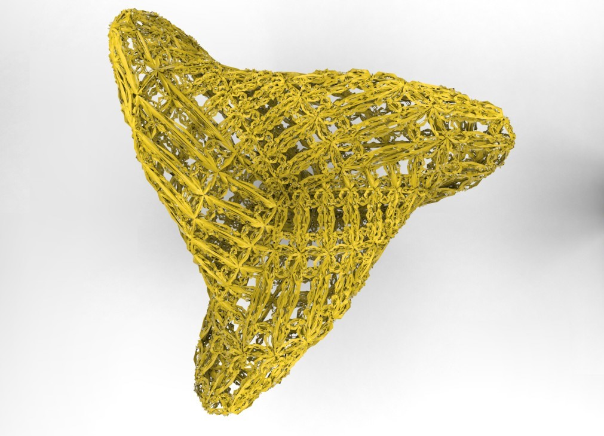

Boy Surface and two subdivision rules. Boy Surface with different parameters

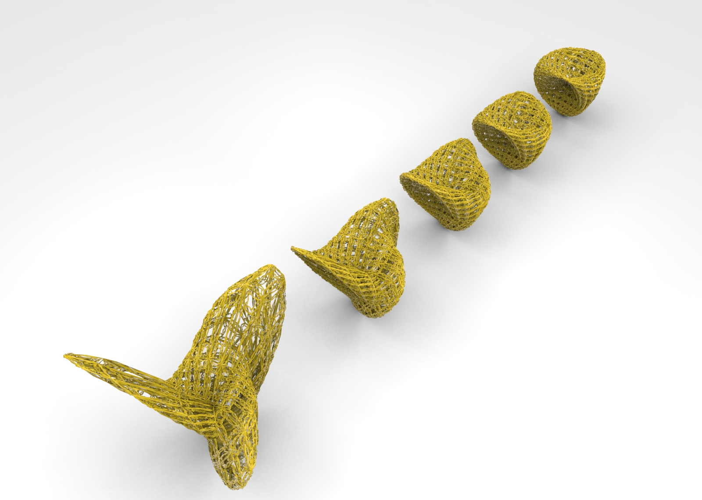

Mesh Analysis - Number of neighbor vertexes.

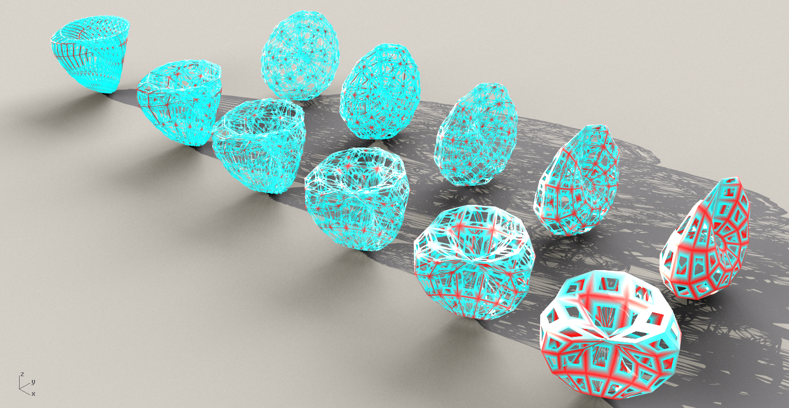

Subdivision Rule - Window Frames:

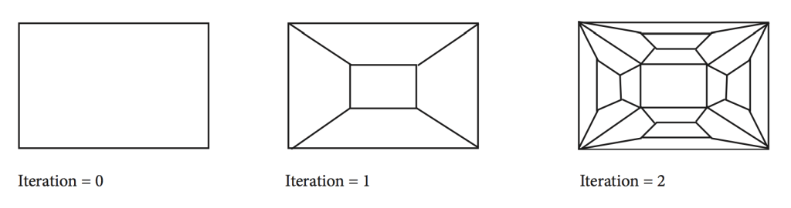

```python
"""
####################################################################
Computational Design Assignment 05
Kao, Ting-Chun
Mesh subdivision and analysis
####################################################################
"""
import Rhino as rh
import Rhino.Geometry as rg
import rhinoscriptsyntax as rs
import math
import System as sys
import scriptcontext as sc

from random import random
from scriptcontext import escape_test

def crossCapVertex(domainXY, resolutionXY):
    vertex = []
    for i in range(resolutionXY[0]+1):
        u = domainXY[0] + (domainXY[1]-domainXY[0])*i/resolutionXY[0]
        for j in range(resolutionXY[1]+1):
            v = domainXY[2] + (domainXY[3]-domainXY[2])*j/resolutionXY[1]
            a = 10
            x = a/2 * math.sin(u) * math.sin(2*v)
            y = a * math.sin(2*u) * math.pow(math.sin(v),2)
            z = a * math.cos(2*u) * math.pow(math.sin(v),2)
            vertex.append( (x,y,z) )
    return vertex

def boySurface(domainXY, resolutionXY):
    vertex = []
    for i in range(resolutionXY[0]+1):
        u = domainXY[0] + (domainXY[1]-domainXY[0])*i/resolutionXY[0]
        for j in range(resolutionXY[1]+1):
            v = domainXY[2] + (domainXY[3]-domainXY[2])*j/resolutionXY[1]
            a = 10
            r = 0.5 # 0 to 1
            b = 2 - r*math.sqrt(2)*math.sin(3*u)*math.sin(2*v)
            x = a * ( math.sqrt(2) * math.cos(2*u) * math.pow(math.cos(v),2) + math.cos(u) * math.sin(2*v) ) / b
            y = a * ( math.sqrt(2) * math.sin(2*u) * math.pow(math.cos(v),2) - math.sin(u) * math.sin(2*v) ) / b
            z = a* 3 *  math.pow(math.cos(v),2) / b
            vertex.append( (x,y,z) )
    return vertex

def createmeshfaces(resolutionXY):
    nX = resolutionXY[0]
    nY = resolutionXY[1]
    f = []
    for i in range(nX):
        for j in range(nY):
            baseindex = i*(nY+1)+j
            A = baseindex
            B = baseindex+1
            C = baseindex+nY+2
            D = baseindex+nY+1
            f.append( (A, B, C, D) )
    return f

def meshfunction_xy():
    domain = (-math.pi, 0, -math.pi, 0)
    resolutionXY = (30,10)
    #verts = crossCapVertex(domain, resolutionXY)
    verts = boySurface(domain, resolutionXY)
    faces = createmeshfaces(resolutionXY)

    return rs.AddMesh(verts, faces)

def midPt(ptsList):

    o = rg.Vector3d(0,0,0)
    for pt in ptsList:
        pt = rg.Vector3d(pt)
        o = rg.Vector3d.Add(o, pt)
    mid = rg.Vector3d.Divide(o, len(ptsList))

    return rg.Point3d(mid)

def midPtList(ptsList):

    o = midPt(ptsList)
    mList = []
    for pt in ptsList:
        pt = rg.Vector3d(pt)
        o = rg.Vector3d(o)
        m = rg.Vector3d.Add(o, pt)
        m = rg.Vector3d.Divide(m, 2)
        m = rg.Point3d(m)
        mList.append(m)

    return mList

def extrudePt(pt, normal, scale):
    if type(pt) is rg.Point3d:
        pt = rg.Vector3d(pt)
        normal = rg.Vector3d.Multiply(scale, normal)
        pt = rg.Vector3d.Add(pt, normal)
        pt = rg.Point3d(pt)
    if type(pt) is list:
        ptList = []
        for p in pt:
            p = rg.Vector3d(p)
            normal = rg.Vector3d.Multiply(scale, normal)
            p = rg.Vector3d.Add(p, normal)
            p = rg.Point3d(p)
            ptList.append(p)
        pt = ptList
    return pt

def meshSubdivisionToCentor(mesh):
    faceVerts = rs.MeshFaceVertices( mesh )
    faceNormal = rs.MeshFaceNormals( mesh )
    verts = rs.MeshVertices(mesh)

    newPtList = verts[:]
    newPtIndexList = []

    for i in range(len(faceVerts)):
        a = faceVerts[i][0]
        b = faceVerts[i][1]
        c = faceVerts[i][2]
        d = faceVerts[i][3]
        fourPt = [verts[a], verts[b], verts[c], verts[d]]

        mid = midPt(fourPt)
        mid = extrudePt(mid, faceNormal[i], 0.2)

        newPtList.append(mid)
        newPtIndexList.append((len(verts)+i))

        #rs.AddPoint(mid)
        escape_test()

    newFaceVertx = []

    for i in range(len(faceVerts)):
        a = faceVerts[i][0]
        b = faceVerts[i][1]
        c = faceVerts[i][2]
        d = faceVerts[i][3]
        e = newPtIndexList[i]

        FaceA = (a, b, e)
        FaceB = (b, c, e)
        FaceC = (c, d, e)
        FaceD = (d, a, e)

        newFaceVertx.append(FaceA)
        newFaceVertx.append(FaceB)
        newFaceVertx.append(FaceC)
        newFaceVertx.append(FaceD)

    newMesh = rs.AddMesh(newPtList, newFaceVertx)

    return newMesh

def meshSubdivisionHole(mesh, iteration = 1):
    faceVerts = rs.MeshFaceVertices( mesh )
    faceNormal = rs.MeshFaceNormals( mesh )
    verts = rs.MeshVertices(mesh)

    newPtList = verts[:]
    newPtIndexList = []

    for i in range(len(faceVerts)):
        a = faceVerts[i][0]
        b = faceVerts[i][1]
        c = faceVerts[i][2]
        d = faceVerts[i][3]
        fourPt = [verts[a], verts[b], verts[c], verts[d]]

        mid4 = midPtList(fourPt)
        if iteration <= 1:
            scale = 0.1
        else:
            scale = 0.4
        mid4List = extrudePt(mid4, faceNormal[i], scale)

        for count, p in enumerate(mid4List):
            newPtList.append(p)
            newPtIndexList.append((len(verts) + i*4 + count))

        escape_test()

    newFaceVertx = []

    for i in range(len(faceVerts)):
        a = faceVerts[i][0]
        b = faceVerts[i][1]
        c = faceVerts[i][2]
        d = faceVerts[i][3]
        e = newPtIndexList[i*4+0]
        f = newPtIndexList[i*4+1]
        g = newPtIndexList[i*4+2]
        h = newPtIndexList[i*4+3]

        FaceA = (a, b, f, e)
        FaceB = (b, c, g, f)
        FaceC = (c, d, h, g)
        FaceD = (d, a, e, h)

        newFaceVertx.append(FaceA)
        newFaceVertx.append(FaceB)
        newFaceVertx.append(FaceC)
        newFaceVertx.append(FaceD)

    newMesh = rs.AddMesh(newPtList, newFaceVertx)

    if iteration > 0:
        escape_test()
        previousMesh = meshSubdivisionHole(newMesh, iteration-1)

        rs.DeleteObject(newMesh)
        return previousMesh

    #"""
    if iteration == 0:
        triangleMesh = meshSubdivisionToCentor(newMesh)

    rs.DeleteObject(newMesh)
    return triangleMesh
    #"""
    #return newMesh

def setMeshColor(oMesh):
    faceVerts = rs.MeshFaceVertices( oMesh )
    faceNormal = rs.MeshFaceNormals( oMesh )
    verts = rs.MeshVertices(oMesh)

    mesh = rg.Mesh()

    for i in verts:
        mesh.Vertices.Add(i)

    for i in faceVerts:
        mesh.Faces.AddFace(i[0], i[1], i[2], i[3])

    topoMeshVertex = mesh.TopologyVertices
    vs = mesh.Vertices
    vs.GetConnectedVertices(0)

    edgeNumber = []
    for i in range(vs.Count):
        index = vs.GetConnectedVertices(i)
        num = len(index)
        edgeNumber.append(num)

    nMax = max(edgeNumber)
    nMin = min(edgeNumber)

    colors = []
    for i in range(vs.Count):
        index = vs.GetConnectedVertices(i)
        num = len(index)
        num = (num-nMin) * 255/(nMax-nMin)
        color = sys.Drawing.Color.FromArgb(num, 255-num,255-num)
        colors.append(color)

    rs.MeshVertexColors(oMesh, colors)

def main():

    rs.EnableRedraw(False)

    obj = meshfunction_xy()
    newObj = meshSubdivisionHole(obj, 2)
    rs.DeleteObject(obj)
    setMeshColor(newObj)

    rs.EnableRedraw(True)


if __name__ == "__main__":
    main()
```
