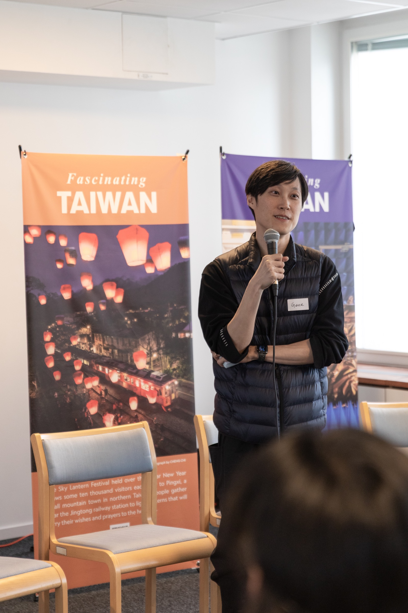
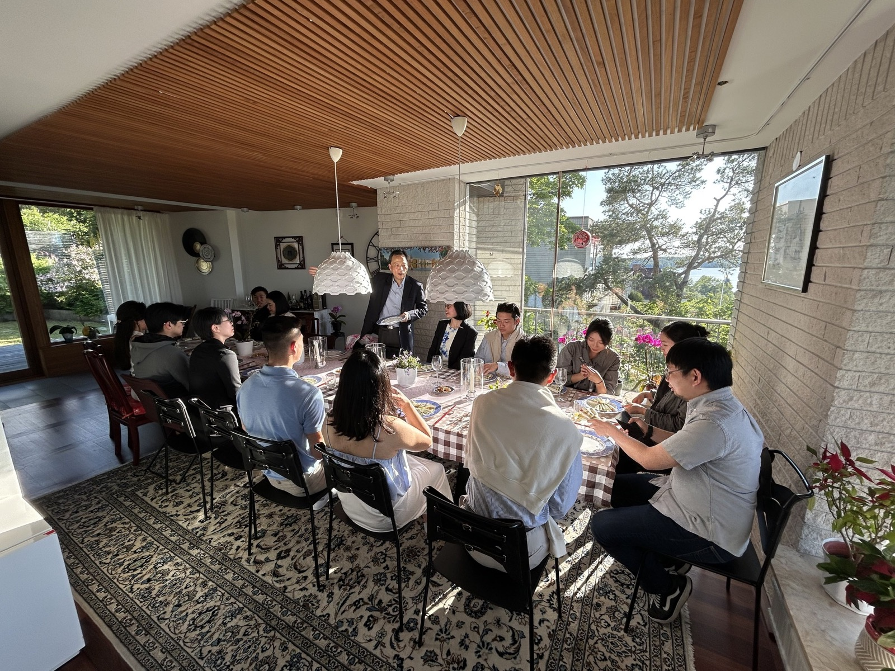
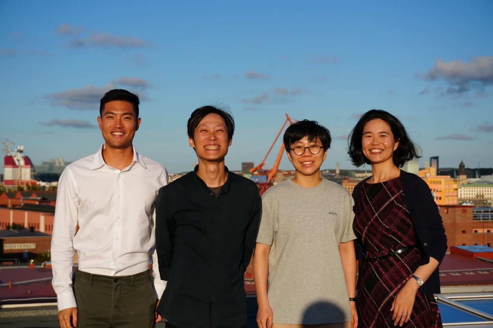

I took on the presidency mostly for two personal reasons: I wanted to get better at leading a team, and I wanted to make some good friends. Both happened. But it turned out to be quite a ride.

The **Taiwanese Junior Chamber of Commerce in Sweden (TCCSJC)** is a volunteer organization for Taiwanese under 40 living in Sweden, operating as the junior chapter of the Taiwanese Chamber of Commerce in Sweden (TCCS). Everyone on the team has a day job. Nobody gets paid. Things move because people choose to make them move.

We organized three events over the year: a dinner hosted at the residence of the Taiwanese Ambassador to Sweden, a career event in Gothenburg, and our flagship career event in Stockholm.

The Gothenburg event was largely driven by our vice-president who lives there. She handled the planning beautifully, and going there to help her and be part of it was genuinely fun. Stockholm was a different story. Behind that one was more coordination than I anticipated. Besides working with the Ambassador's secretary and applying for sponsorship through Taiwan's Overseas Community Affairs Council, I was in charge of writing grant proposals and post-event reports, organising speakers and moderators, planning the logistics, writing social media posts, and sourcing food and drinks from Taiwanese-owned businesses in Sweden so the event could give something back to the community it was meant to serve.

My secretary general and I planned the budget and funding proposal carefully, and ended up securing the largest sponsorship amount in TCCSJC's recent years. On the day, over 60 people filled the room with 84 joining in total including online participants. Seeing it all come together was really satisfying.

Looking back on this year, the hardest part wasn't the logistics. It was the people. There were moments where I genuinely thought: why did I sign up for this? There was some politics that had to be handled carefully, moments where I had to smooth things over quietly before they got worse. One team member wasn't pulling their weight and I had to cover the gap without making it a bigger issue than it needed to be. I think what I learned is that in these situations you can't just wait and hope things sort themselves out. You just deal with it and move on.

Working with TCCS, our parent organization, was a different kind of challenge. We do things differently and think about things differently. A lot of what I learned was how to navigate that relationship smoothly and look out for my team when it mattered.

Last Saturday I handed the presidency over to the next person. There was an election, but I had already decided not to run again. I have a new dog coming, things I want to focus on in my career, and other things in my personal life that I want to give proper attention to. It felt like the right time to stop.

I'm glad I did it. I learned a lot about managing a team, about the kind of leader I want to be, and about patience. And I think I did a decent job. More than anything though, I made real friends. Some of the speakers became people I actually hang out with now. A few team members I know I'll stay in touch with for a long time. That was the whole point of taking on the presidency, and it was worth it.

Thank you to everyone who made this year possible, especially the team, the TCCSJC family, and everyone who showed up.
