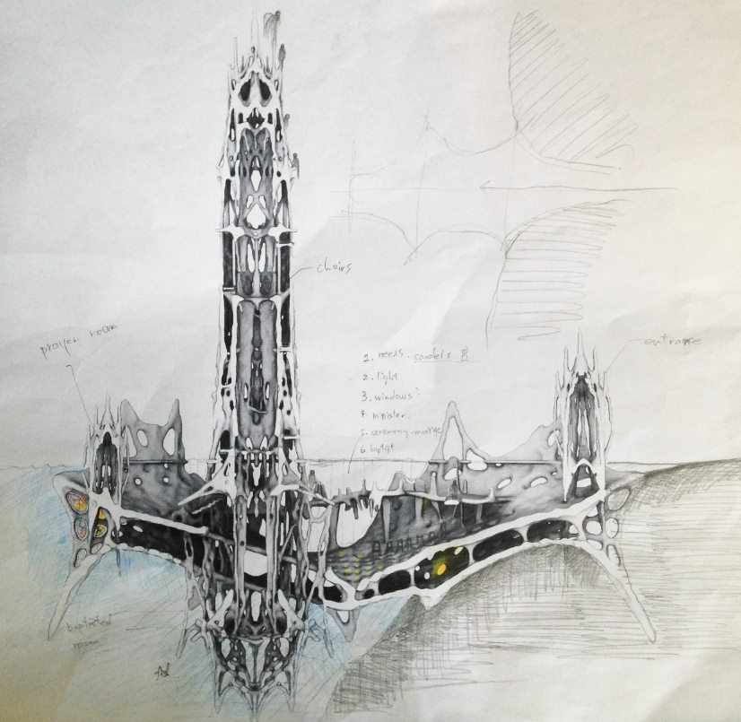
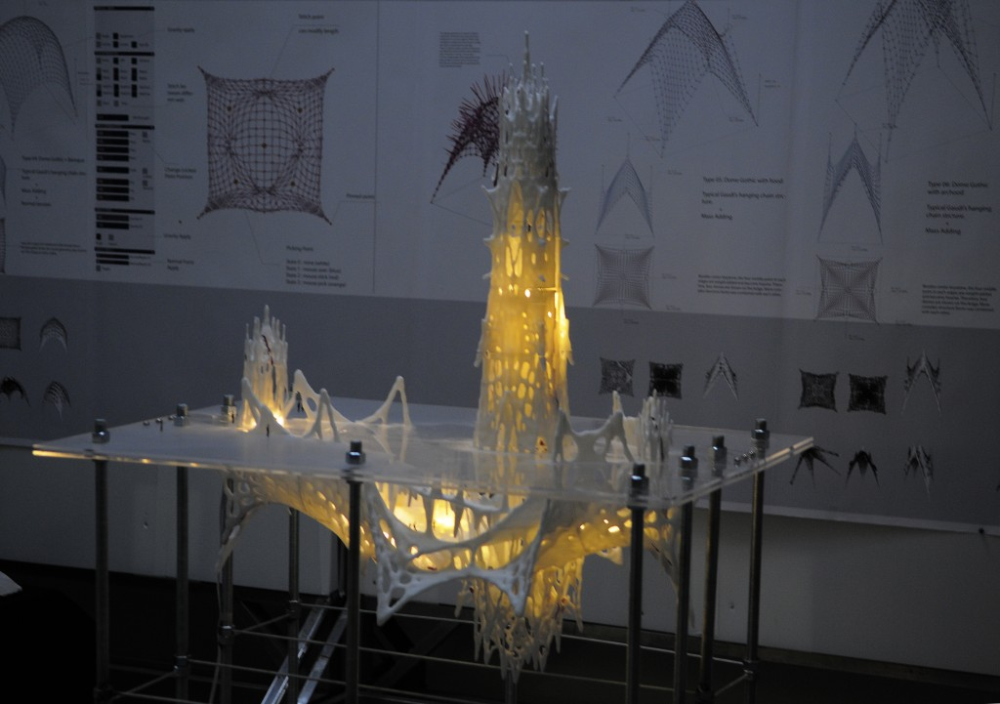
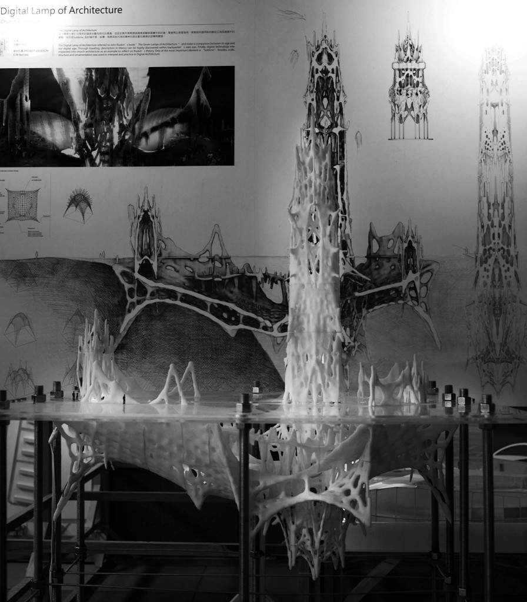
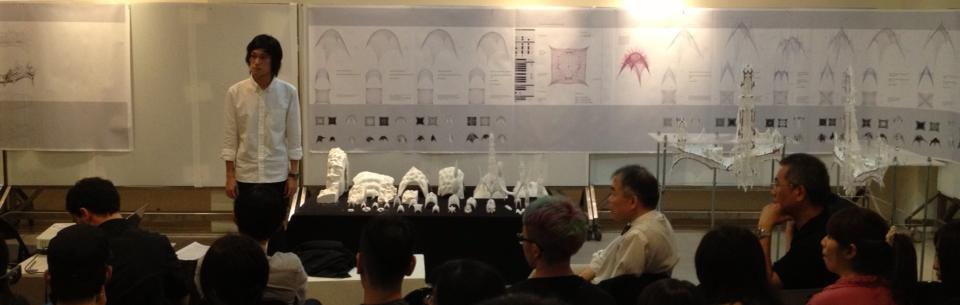

In the past, human beings were known for having strong faith and devoted minds. As a result, church architecture became the bridge between humans and the Creator, the sacred and the secular, as well as darkness and lightness. The best technology at the time was used to deeply affect believers, stimulating them with the powerful ambience of church architecture, and allowing them to ultimately realize that men were as insignificant as a drop in the bucket.

Referencing John Ruskin's "The Seven Lamps of Architecture," the most significant element of good architecture is the feature of sublimity. This majestic grandness is present in gothic architecture.

By combining classical elements with modern computing technology, one can now capture features such as vastness of space, optimized structures and detailed ornamentations, while approaching them with a strong sense of beauty and aesthetics.

In the Digital Lamp of Architecture – A New Church Prototype, Antoni Gaudí's hanging chain methodology is implemented, improved and extended using computing technology. Multiple forces are used in the process of programming. These forces stretch more than one surface at a time and, as the programming process reaches an end, a sense of balance is achieved. This balance encompasses a dynamic display of uncertainty as well as physical rules that represent the religious and scientific system, ultimately combining both top-down and bottom-up approaches to architectural design.

<blockquote class="embedly-card"><h4><a href="/blog/computation-and-aesthetics/">Computation and Aesthetics</a></h4>
Gene Kao, Ting-Chun portfolio 2008-2013
</blockquote>

