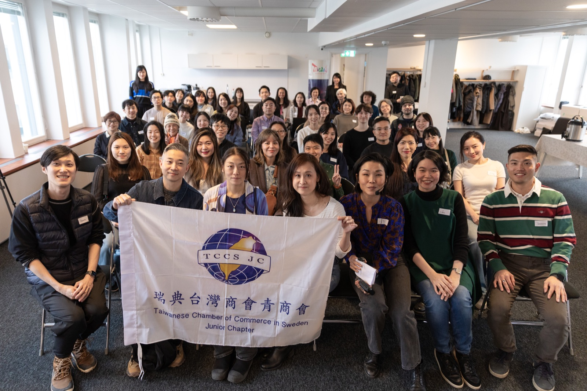

I said yes for two reasons: I wanted to practice being a better leader (managing a team, delegating well, earning trust) and I wanted to make good friends. Looking back now, I achieved both. But the year between saying yes and saying goodbye was far more demanding than I expected.

The **Taiwanese Junior Chamber of Commerce in Sweden (TCCSJC)** is a volunteer organization for Taiwanese under 40 living in Sweden, operating as the junior chapter of the Taiwanese Chamber of Commerce in Sweden (TCCS). Everyone on the team has a day job. Nobody gets paid. Things move because people choose to make them move.

We organized three events over the year: a dinner hosted at the residence of the Taiwanese Ambassador to Sweden, a career event in Gothenburg, and our flagship career event in Stockholm.

The Gothenburg event was largely driven by our vice-president who lives there. She handled the planning beautifully, and going up to help her and be part of it was genuinely fun. Stockholm was a different story. Behind that one was more coordination than I anticipated. I had to work with the Ambassador's secretary, apply for sponsorship through Taiwan's Overseas Community Affairs Council, write grant proposals and post-event reports, and source food and drinks from Taiwanese-owned businesses in Sweden so the event could give something back to the community it was meant to serve.

For Stockholm, the team and I planned everything strategically from the start: the programme, the budget, the funding proposal. We secured the largest sponsorship amount in TCCSJC's recent years. And then over 60 people filled the room, with 84 joining in total including online participants. Seeing it all come together: the speakers, the moderators, the food from Taiwanese businesses, the conversations in the room, was really satisfying.

Looking back on this year, the hardest part wasn't the logistics. It was the people. At one point, things were difficult enough that I genuinely asked myself why I had signed up for this. Politics and relationships had to be handled carefully, and there were moments I had to do quiet diplomacy to keep things from escalating. A team member wasn't delivering, and I had to step in, clean up, and keep moving without letting it poison the rest of the team. I learned that when something isn't working, waiting and hoping doesn't help anyone. You step in early, you redistribute, you keep the mission in front of people.

Working alongside TCCS, our parent organization, pushed me in a different direction. The older generation cares about different things, sees situations through a different lens, and brings strengths I genuinely don't have. But we also approach planning very differently, and what feels obvious to me isn't always obvious to them, and vice versa. Learning to work across that gap, without assuming my way is simply the right way, took more patience and humility than I expected. It stretched me.

Last Saturday I handed the presidency over to the next person. There was an election, but I had already decided to step down. I told everyone not to vote for me. I have a new dog coming, career plans, and other things ahead that I want to give my full attention to. It felt like the right time to close this chapter on my own terms.

I learned more than I expected about leadership, communication, and getting things done through people who don't have to listen to you. And honestly, I think I managed the team pretty well this year. Managing people and relationships is tiring in a way that technical work isn't, so I think I earned the break. But more than anything, I made genuine friends. Speakers who became regulars in my life, team members I'll stay close to long after this year is forgotten. Those friendships were the whole point, and I'm grateful for every one of them.

Thank you to everyone who made this year possible, especially the team, the TCCSJC family, and everyone who showed up.
