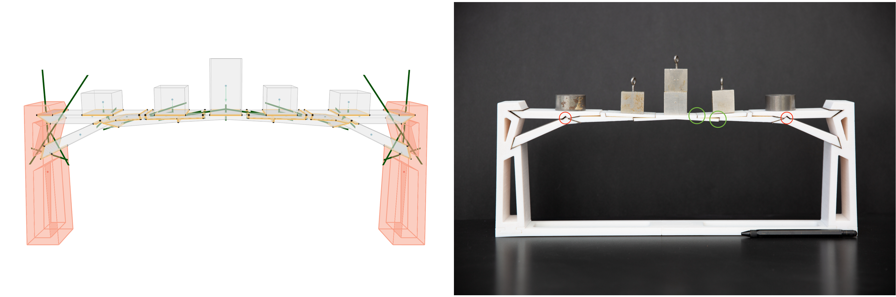

## Abstract

The rigid-block equilibrium (RBE) method uses a penalty formulation to measure structural infeasibility or to guide the design of stable discrete-element assemblies from unstable geometry. However, RBE is a purely force-based formulation, and it incorrectly describes stability when complex interface geometries are involved. To overcome this issue, this paper introduces the coupled rigid-block analysis (CRA) method, a more robust approach building upon RBE's strengths. The CRA method combines equilibrium and kinematics in a penalty formulation in a nonlinear programming problem. An extensive benchmark campaign is used to show how CRA enables accurate modelling of complex three-dimensional discrete-element assemblies formed by rigid blocks. In addition, an interactive stability-aware design process to guide user design towards structurally-sound assemblies is proposed. Finally, the potential of our method for real-world problems are demonstrated by designing complex and scaffolding-free physical models.
