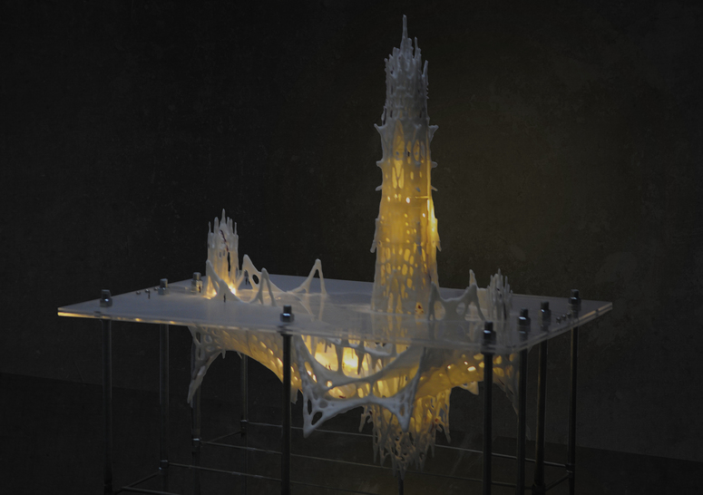
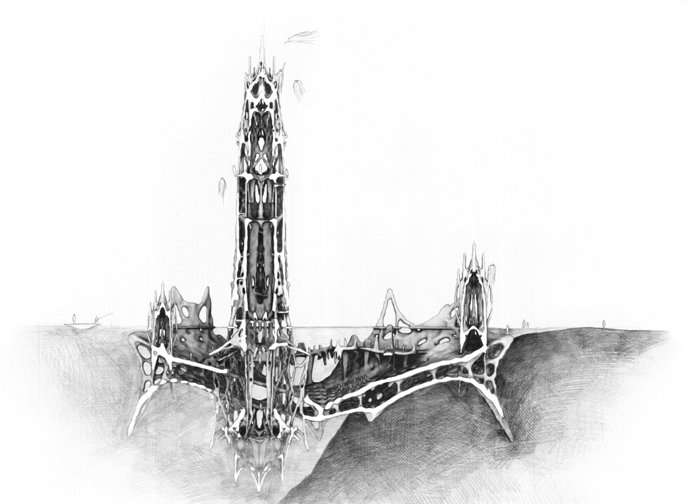



This project was my undergraduate architectural thesis design using Processing + Java. Java SE 6 environment.

The Digital Lamp of Architecture — A New Church Prototype

The Digital Lamp of Architecture referred to John Ruskin's book *The Seven Lamps of Architecture* and makes a comparison between its age and our digital age. Through traveling, descriptions in theory can be highly discovered within a backpacker's own eye. Finally, digital technology was implanted into church architecture as an example to reflect on Ruskin's theory. One of the most important elements is "Sublime." Besides scale, structure, and ornamentation were used to interpret and practice digital architecture.
