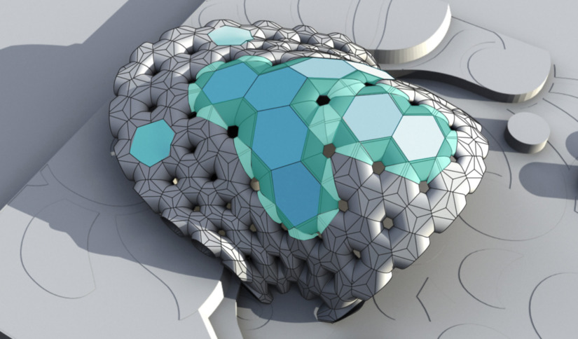
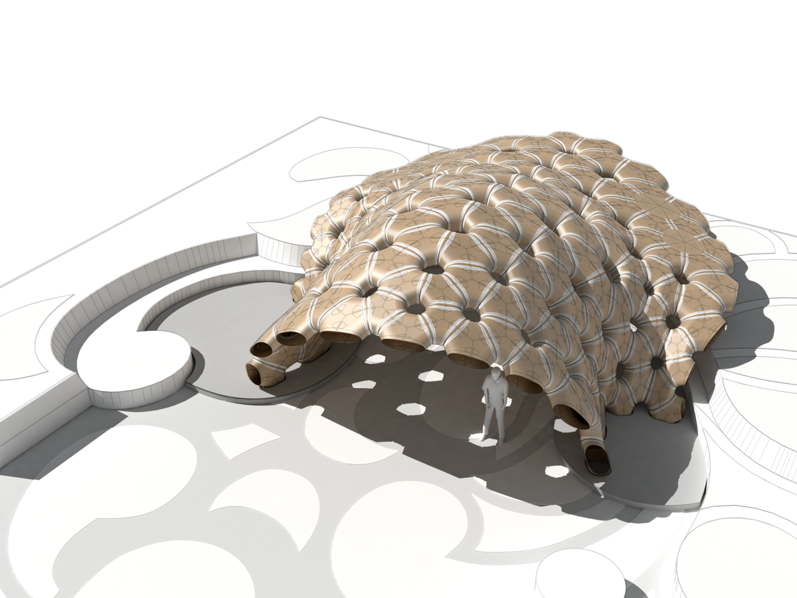



I was in the computational design team while designing the [ICD/ITKE Research Pavilion 2015-16](https://boty.archdaily.com/us/2017/candidates/103332/icd-itke-research-pavilion-2015-16-icd-itke-university-of-stuttgart) and was mainly in charge of developing computational tools.

One of the input parameters from the plugin is a mesh surface, and the output parameters are all tree data structure, allowing double-layer lightweight structures as well as planar plates to be generated. All geometries are labeled in the right sequence so they can be fabricated directly.

The code project was developed together with Julian Wengzinek, Thu Nguyen-Phuoc, and Long Nguyen.

