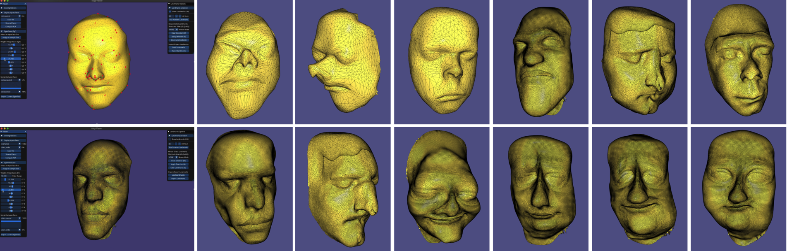

Course project, collaboration with Ting-Yu Chen, Wen-Chieh Tung, Kaiyue Shen, Zimeng Jiang.

High-dimensional 3D scanned point cloud face data. Implemented rigid registration, non-rigid warping, PCA methods, data processing pipeline of 3D geometric learning, and generated unlimited faces. GUI design for users to morph between faces.
