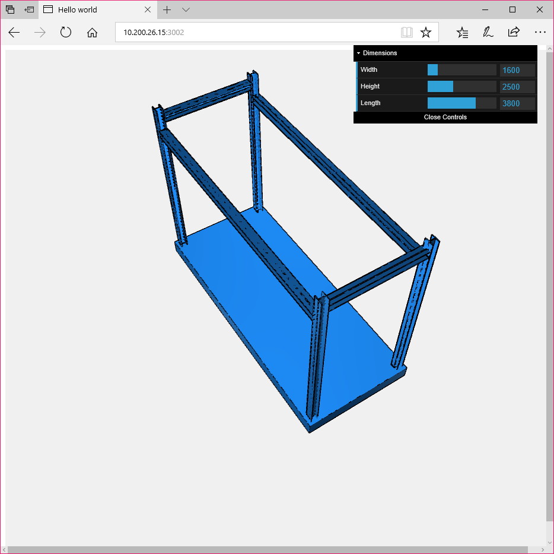
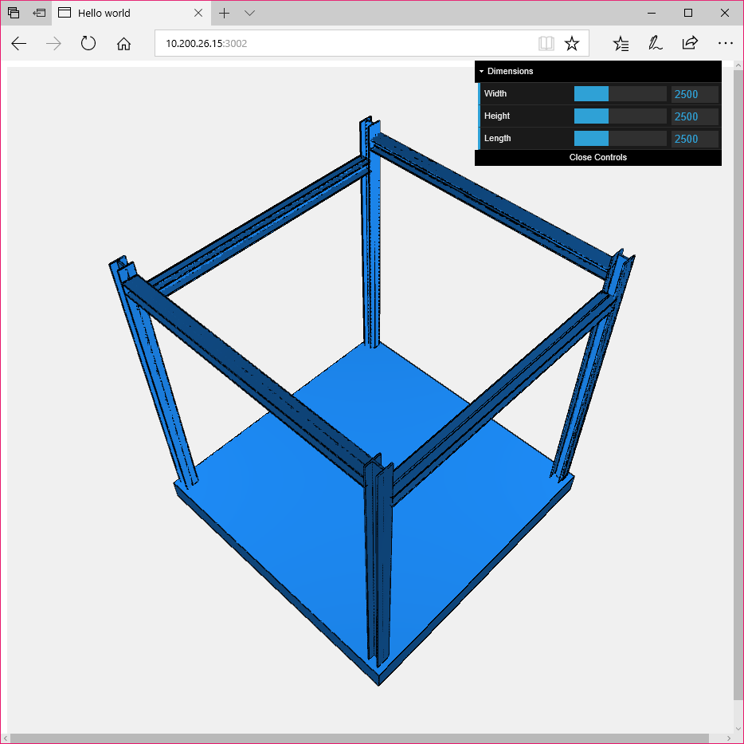
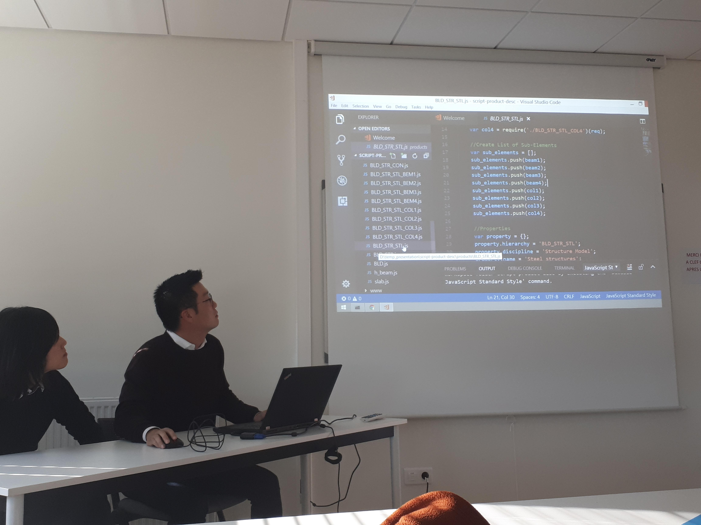

Using modern programming language as a file format for describing, sharing, and visualizing 3D product information. Presented at the Linked Data in Architecture and Construction (LDAC) 2017 with Hojoong Chung at Dijon, France.
